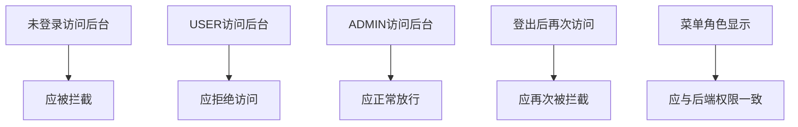

# 核心案例：第15讲 用户认证与权限控制

## 课堂主题与定位

`从“能登录”到“能守住后台”`  
通过一个可运行但带逻辑缺陷的 Java Web 工程，组织学生完成“诊断 -> 修复 -> 验证”全过程。

  Authentication
  Authorization
  RBAC
  Filter
  Session

## 修复前后对照图

  

## 45分钟课堂时间轴

  

## 问题版工程（3个核心缺陷）

1. `RoleBasedAuthFilter` 只判断是否登录，不判断 `ADMIN` 角色。
2. `index.jsp` 登录后统一显示“管理后台”，视图和授权不一致。
3. `LogoutServlet` 退出不彻底，会话失效机制不规范。

对应文件：

- `第十五讲录课示例工程-问题版/src/main/java/com/tyust/demo/filter/RoleBasedAuthFilter.java`
- `第十五讲录课示例工程-问题版/src/main/java/com/tyust/demo/controller/LogoutServlet.java`
- `第十五讲录课示例工程-问题版/src/main/webapp/index.jsp`

## 课堂验证路径（5步）

## 人机协同教学动作

| 阶段 | 学生动作 | 教师动作 | AI动作 |
|---|---|---|---|
| 诊断 | 分组审查代码 | 引导提问与纠偏 | 生成问题清单 |
| 修复 | 修改关键逻辑 | 讲解知识点映射 | 提供修改建议 |
| 验证 | 按路径测试 | 组织结果复盘 | 生成最小验证清单 |

## 资源与证据入口

1. [课堂实录讲稿](/assets/docs/D05_课堂实录逐分钟讲稿.pdf)
2. [AI提示词与测试清单](/assets/docs/D06_AI提示词与测试清单.pdf)
3. [问题版工程README](/assets/docs/D07_问题版工程README.pdf)
4. [成效与数据](/results/)

## 评审结论点

1. 课堂任务具备真实问题张力，不是工具演示。
2. AI 参与的是教学过程，不是替代学生完成答案。
3. 修复结果可通过角色路径直接验证，证据链闭环完整。
