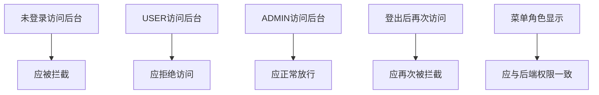

# 核心案例：第15讲 用户认证与权限控制

## 课堂主题与定位

`从"能登录"到"能守住后台"`
通过一个可运行但带逻辑缺陷的 Java Web 工程，组织学生完成AI辅助的安全挑战、人机对抗代码审查、协作修复与验证全过程。

  Authentication
  Authorization
  智能助教
  编程挑战
  人机对抗
  TeamCoach

### 为什么选第十五讲

这是唯一一讲能在45分钟内自然展现多维AI融合创新的课程内容：

- **知识综合性极高**：Session + Filter + DAO + MVC + 安全，覆盖前14讲核心知识
- **安全教学天然适合编程挑战**：SQL注入、越权访问、Session安全等漏洞可生成丰富的挑战关卡
- **代码审查对抗效果最佳**：安全漏洞隐蔽性强，人与AI的发现差异最具教学价值
- **思政融合自然**：依法治网、权责明晰、安全合规

## 45分钟课堂时间轴（五阶段设计）

### 课前准备（课外教学展示视频展示）

| 时间 | 活动 | AI融合维度 |
|:---|:---|:---|
| 课前3天 | 教师在智能助教中发布预习任务：「什么是认证？什么是授权？两者的区别？」 | 智能助教 |
| 课前3天 | AI根据学生前14讲表现，为不同层次学生生成不同难度的预习思考题 | 智能助教 |
| 课前1天 | 教师查看智能助教后台：全班提问热力图、知识薄弱点分析 | 智能助教 |
| 课前1天 | AI生成TeamCoach周报：各组项目进度、贡献度、风险预警 | 团队教练 |
| 课前1天 | 教师据此调整课堂重点：发现多数学生混淆Session.invalidate()和removeAttribute() | 数据驱动决策 |

### 阶段一：数据驱动导入（0-5分钟）

  

    
1

    <h4>展示智能助教数据</h4>
    
教师打开智能助教后台： "课前42人提问，热点TOP3：Session过期处理、角色判断、Cookie安全" → 据此确定今天重点

  

  

    
2

    <h4>展示TeamCoach报告</h4>
    
投影团队项目周报： "第3组Service层无人负责，今天实战中注意观察" "全班测试覆盖率为0%"

  

  

    
3

    <h4>问题导入</h4>
    
现场演示"课程作业管理系统"的权限漏洞： 普通用户tom成功进入管理后台 → "能登录 ≠ 能安全控制访问"

  

  📊
  

    <strong>AI融合体现：</strong>智能助教提供学情数据驱动教学决策，TeamCoach提供团队过程数据辅助关注重点。教师不再凭经验猜测，而是<strong>用数据说话</strong>。
  

### 阶段二：AI自适应安全挑战（5-20分钟）

  

    
规则

    <h4>挑战说明（2min）</h4>
    
打开编程挑战平台，展示3个安全关卡 AI为每人生成不同漏洞代码 "每人题目不同，找到漏洞→修复→自动测试→过关"

  

  

    
闯

    <h4>学生挑战（8min）</h4>
    
完成第1-3关：SQL注入、越权访问、Session安全 教师巡视 + 看实时数据大屏 大屏：各关通过率、平均用时、当前排名

  

  

    
干预

    <h4>数据驱动干预（5min）</h4>
    
教师看到"第2关通过率仅40%" → 暂停挑战，集中讲解Filter权限检查 → 对比"有Filter"和"无Filter"的请求流程 → 讲完后继续挑战

  

  🎮
  

    <strong>AI融合体现：</strong>AI为每位学生动态生成不同漏洞代码（一人一题），自动判定修复结果，实时数据大屏让教师<strong>精准发现共性薄弱点并即时干预</strong>。
  

### 阶段三：人机对抗 Code Review Battle（20-35分钟）

  

    
分组

    <h4>任务分配（1min）</h4>
    
分A/B/C三组，每组聚焦不同模块： A组：LoginServlet（认证） B组：AuthFilter（授权） C组：index.jsp（视图一致性）

  

  

    
人审

    <h4>人工审查（5min）</h4>
    
各组分析代码，找出安全问题 记录：问题位置、风险描述、修复建议

  

  

    
AI审

    <h4>AI审查（2min）</h4>
    
教师将代码提交给AI 投影展示完整过程 AI输出审查报告

  

  

    
辩论

    <h4>对比与辩论（7min）</h4>
    
各组汇报：我们找到了什么？AI找到了什么？ AI找到但学生未发现 → 学习机会 学生找到但AI遗漏 → 建立信心 AI错误建议 → 批判性思维训练

  

  ⚔️
  

    <strong>AI融合体现：</strong>人机对抗的目的不是证明谁更强，而是<strong>培养学生的批判性思维和独立判断能力</strong>。通过对比发现，人类在业务理解上有优势，AI在模式识别上有优势——<strong>人机协同才是最优解</strong>。
  

### 阶段四：修复实践与验证（35-42分钟）

  

    
修

    <h4>分组修复（4min）</h4>
    
各组根据审查结果修复代码 允许向智能助教提问不理解的知识点 教师重点关注TeamCoach周报中标记的薄弱学生

  

  

    
验

    <h4>验证演示（3min）</h4>
    
教师用修复后的代码运行系统 tom登录后不再能访问管理后台 → 403 运行全部13项测试用例 → 全部通过

  

### 阶段五：总结与反思（42-45分钟）

- **数据回顾**：展示本节课数据——挑战通过率、人机对抗得分对比、智能助教实时提问记录
- **知识总结**：认证vs授权、Session安全、RBAC模型
- **AI协作反思**：AI是工具不是替代品，人机协同才是最优模式
- **课后布置**：完成挑战剩余关卡（第4-5关），团队项目中实现权限模块（TeamCoach追踪），有疑问随时向智能助教提问

## 课堂验证路径（5步）

## 问题版工程（3个核心缺陷）

1. `RoleBasedAuthFilter` 只判断是否登录，不判断 `ADMIN` 角色。
2. `index.jsp` 登录后统一显示"管理后台"，视图和授权不一致。
3. `LogoutServlet` 退出不彻底，会话失效机制不规范。

## 人机协同教学动作表

| 阶段 | 学生动作 | 教师动作 | AI动作 | AI融合维度 |
|---|---|---|---|---|
| 导入 | 回顾预习内容 | 展示学情数据与周报 | 提供学情热力图、团队周报 | 智能助教+团队教练 |
| 挑战 | 独立解题闯关 | 巡视+据数据干预 | 动态出题+自动判定+数据大屏 | 编程挑战 |
| 对抗 | 分组审查找问题 | 组织对比与辩论 | 生成审查报告 | 人机对抗 |
| 修复 | 修改关键逻辑 | 讲解知识点+关注薄弱生 | 提供知识查询支持 | 智能助教 |
| 验证 | 按路径测试 | 组织结果复盘 | 生成验证清单 | — |

## 资源与成果入口

1. [AI提示词与测试清单](/assets/docs/D06_AI提示词与测试清单.pdf)
2. [问题版工程README](/assets/docs/D07_问题版工程README.pdf)
3. [成效与数据](/results/)

## 评审结论点

1. 课堂任务具备真实问题张力，不是工具演示。
2. **多维AI融合创新在45分钟内自然落地**——智能助教提供数据、编程挑战激发参与、人机对抗培养思维、团队教练辅助关注。
3. AI参与的是教学过程，不是替代学生完成答案。
4. 修复结果可通过角色路径直接验证，验证闭环完整。
5. 教师始终掌控课堂节奏，AI数据支撑教学决策而非替代决策。
