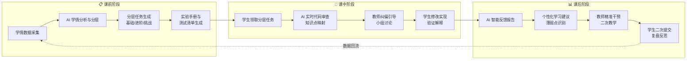

# AI教学创新设计

本方案以Java Web应用开发课程为载体，围绕"任务同质化、审查滞后、知而不会、分层失配"四大教学痛点，构建了一套<strong>课前-课中-课后</strong>三阶段闭环的AI赋能教学体系。AI不替代教师、不替代学生思考，而是作为<strong>教学过程中的结构化协作者</strong>——在精准诊断、分层供给、实时反馈三个关键环节提供数据驱动的支撑，让教师从重复劳动中解放，将精力聚焦于高阶教学决策与个性化干预。

  人工智能赛道
  Java Web 应用开发
  课前-课中-课后闭环
  数据驱动
  人机协同
  分层教学

  

    
4

    
核心教学痛点

  

  

    
3

    
闭环教学阶段

  

  

    
3

    
协同角色（AI·教师·学生）

  

  

    
4

    
数据驱动机制层

  

## 一图看懂：系统化赋能架构

下图展示了AI赋能教学的整体架构：从底层数据采集到上层教学决策，AI贯穿课前学情分析、课中实时辅助、课后智能反馈全过程，与教师和学生形成三方协同闭环。

  

  

    
🎯

    <h3>问题驱动</h3>
    
以真实课堂痛点为起点，而非技术炫技。每项AI应用均可追溯到具体教学问题与改进目标。

  

  

    
🔄

    <h3>闭环迭代</h3>
    
课前诊断、课中干预、课后反馈三阶段数据贯通，形成可持续优化的教学改进循环。

  

  

    
🤝

    <h3>人机协同</h3>
    
AI承担结构化、重复性工作；教师保留高阶决策与价值引导；学生始终是学习主体。

  

## 核心痛点与改革目标

经过三轮教学周期的系统观察与数据收集，我们识别出Java Web课程教学中四个相互关联、层层加深的核心痛点。这些痛点不是孤立存在的——任务同质化导致抄袭泛滥，审查压力加大又导致反馈延迟，表层完成掩盖了深层理解不足，而统一难度设计则使问题在不同层次学生中以不同方式放大。

  

    ⚠️ Pain #01
    <h3>任务同质化与抄袭风险</h3>
    
统一题目导致高相似度提交，MOSS检测显示对照组 >60% 相似配对高达24.8%。教师难以评估学生真实能力，成绩公平性受到挑战。

  

  

    ⚠️ Pain #02
    <h3>审查成本高、反馈滞后</h3>
    
教师逐份人工审查每份耗时32.8分钟，全学期折合474.6小时。反馈周期长达5-7天，学生收到时已遗忘编码时的困惑点，干预窗口错失。

  

  

    ⚠️ Pain #03
    <h3>功能完成不等于知识掌握</h3>
    
系统可运行但知识点理解薄弱——首次摸底仅12.1%学生能识别SQL注入风险，PreparedStatement正确使用率仅5.2%。安全与规范意识严重不足。

  

  

    ⚠️ Pain #04
    <h3>统一难度无法适配分层学情</h3>
    
基础学生跟不上节奏产生畏难情绪，强学生缺乏挑战感投入度降低。课堂参与两极分化，传统教学设计无法同时满足差异化需求。

  

  💡
  

    <strong>设计理念：</strong>本方案不是用AI去"解决所有问题"，而是针对上述四个痛点，在教学流程的关键节点嵌入AI能力——分层任务生成消解同质化，自动初审释放教师时间，知识点映射穿透表层运行，自适应难度适配分层学情。
  

## 传统教学 vs AI赋能教学

对比传统教学模式与AI赋能后的教学模式，可以清晰看到AI在哪些环节带来了结构性改变——不是简单的效率提升，而是教学逻辑的重塑。

  

    <h4>❌ 传统教学模式</h4>
    <ul>
      <li><strong>任务设计：</strong>统一题目，全班相同，抄袭比例高</li>
      <li><strong>代码审查：</strong>教师逐份人工审查，每份 32.8 分钟</li>
      <li><strong>反馈周期：</strong>5-7 天后集中返回，错失干预窗口</li>
      <li><strong>知识诊断：</strong>依赖期末考试，过程中缺少精细化追踪</li>
      <li><strong>分层适配：</strong>统一难度，强弱学生无差异化支撑</li>
      <li><strong>学术诚信：</strong>仅靠查重工具事后筛查</li>
    </ul>
  

  

    <h4>✅ AI赋能教学模式</h4>
    <ul>
      <li><strong>任务设计：</strong>AI分层生成个性化任务，高相似配对降至 0%</li>
      <li><strong>代码审查：</strong>AI 初审 + 教师复核，每份仅需 11.9 分钟</li>
      <li><strong>反馈周期：</strong>课中实时反馈，当堂完成"诊断-修复-验证"</li>
      <li><strong>知识诊断：</strong>知识点映射持续追踪，16周四时间点监测</li>
      <li><strong>分层适配：</strong>基础/进阶/挑战三级任务自适应匹配</li>
      <li><strong>学术诚信：</strong>"建议-判断-验证-解释"全流程可溯源</li>
    </ul>
  

## 课前-课中-课后教学闭环

教学创新的核心不在于单点的AI功能应用，而在于<strong>三阶段闭环</strong>的系统化设计。数据在课前、课中、课后之间流转贯通——课前的学情诊断驱动课中的差异化教学，课中的过程数据反馈到课后的精准干预，课后的学习分析又成为下一轮课前设计的输入。

### Mermaid 流程图

### 闭环详解：九步教学流转

  

    
1

    <h4>学情数据采集</h4>
    
汇总前序作业、测试记录、知识点掌握度，构建学生画像

  

  

    
2

    <h4>AI学情分析</h4>
    
按知识图谱聚类分析薄弱点，输出学情诊断报告与分层建议

  

  

    
3

    <h4>分层任务生成</h4>
    
基础/进阶/挑战三级任务自动生成，确保每组题目独立且难度适配

  

  

    
4

    <h4>手册与清单</h4>
    
自动生成实验操作手册、验证测试清单，明确任务边界与评分标准

  

  

    
5

    <h4>AI代码初审</h4>
    
课中实时扫描学生代码，检测规范问题、安全漏洞、逻辑缺陷

  

  

    
6

    <h4>教师纠偏引导</h4>
    
基于AI初审结果，教师聚焦高频问题，组织小组讨论与知识点讲解

  

  

    
7

    <h4>修改与验证</h4>
    
学生根据反馈修改代码，按验证清单逐项测试，用自己的语言解释修复逻辑

  

  

    
8

    <h4>智能反馈报告</h4>
    
课后AI聚合过程数据，生成个人与小组反馈报告，识别共性与个性薄弱点

  

  

    
9

    <h4>精准干预迭代</h4>
    
教师基于数据报告开展定向再教学，学生二次提交与复盘，数据回流至下一轮

  

  🔁
  

    <strong>闭环关键：</strong>第9步的数据回流至第1步，形成持续优化的教学迭代。每一轮循环都基于上一轮的真实数据进行调整，而非凭经验猜测。16周教学周期内完成14次完整迭代。
  

## 角色协同矩阵

AI赋能教学的核心原则是<strong>"AI不越位、教师不缺位、学生不让位"</strong>。三方角色在每个教学阶段各有明确边界与职责——AI负责数据密集型的分析与生成，教师负责价值判断与高阶引导，学生始终是知识建构的主体。

| 阶段 | AI 职责 | 教师职责 | 学生职责 |
|:---|:---|:---|:---|
| **课前** | 学情数据分析与聚类 分层任务自动生成 实验手册与测试清单生成 | 教学目标设定与审核 任务难度校准与发布 分层方案确认 | 完成预习任务 确认任务目标 自查前序知识点 |
| **课中** | 代码实时初审与标注 知识点映射与关联 最小验证清单建议 | 问题纠偏与引导提问 组织小组讨论与协作 过程性评价与记录 | 诊断问题根因 修改实现并测试 用自己语言解释修复逻辑 |
| **课后** | 反馈数据聚合与分析 个性化学习建议生成 薄弱知识点识别预警 | 精准定向干预与再教学 任务迭代与难度调整 学情跟踪与个别辅导 | 二次提交与修改 复盘反思与总结 拓展实践与自主探索 |

  

    
🤖

    <h3>AI 定位：结构化协作者</h3>
    
承担数据采集、模式识别、报告生成等结构化工作。AI提供的是"建议"而非"答案"，所有输出均需经过教师审核或学生验证。

  

  

    
👨‍🏫

    <h3>教师定位：教学决策者</h3>
    
保留目标设定、难度校准、价值引导等高阶决策权。AI释放的时间（节约63.7%审查时间）被重新投入到个性化辅导与深度教学中。

  

  

    
👨‍🎓

    <h3>学生定位：学习建构者</h3>
    
始终是知识建构的主体。AI辅助诊断问题，但修复、验证、解释必须由学生独立完成。"建议-判断-验证-解释"四步确保深度学习发生。

  

## 数据驱动机制

数据驱动不是口号，而是贯穿教学全过程的系统化机制。从原始数据采集到教学干预落地，经过四个层次的结构化处理，确保每一项教学决策都有数据支撑，每一次干预都可追溯效果。

  

    <h4>第一层：数据采集</h4>
    
多维度持续采集教学过程数据——包括作业提交记录、代码审查结果、课堂互动日志、测试成绩、AI对话记录等。建立以知识点为索引的结构化数据仓库，16周内累计采集 14 批次完整过程数据。

  

  

    <h4>第二层：数据分析</h4>
    
按知识图谱维度对采集数据进行聚类分析——识别知识点掌握缺口、权限与安全类高频错误、代码规范偏差模式。通过MOSS相似度检测追踪原创性变化，通过编译通过率趋势追踪能力成长轨迹。

  

  

    <h4>第三层：反馈生成</h4>
    
基于分析结果自动生成两级反馈报告：<strong>小组维度</strong>聚焦共性问题与协作模式，<strong>个人维度</strong>精准定位个体薄弱点与学习建议。反馈内容具体可执行，避免泛泛评价。

  

  

    <h4>第四层：教学干预</h4>
    
教师基于数据报告制定精准干预策略——针对高频共性问题开展定向再教学，针对个别学生薄弱点进行个性化辅导，针对下一轮课前设计进行任务难度动态调整。干预效果通过下一轮数据闭环验证。

  

  

    
采

    <h4>作业 + 测试 + 审查</h4>
    
14批次作业、4次阶段测试、实时审查记录持续汇入

  

  

    
析

    <h4>知识点 + 安全 + 规范</h4>
    
按维度聚类，识别SQL注入、命名规范、MVC架构等典型模式

  

  

    
馈

    <h4>小组报告 + 个人建议</h4>
    
自动生成可执行反馈，精准到具体代码行与知识点

  

  

    
干

    <h4>定向再教学 + 任务迭代</h4>
    
共性问题集中讲解，个性问题定向辅导，下轮任务动态调整

  

  📊
  

    <strong>数据实证：</strong>四层机制运转16周后，实验组首次编译通过率从基线75.9%提升至93.1%（+17.2pp），安全漏洞数从每份3.4降至1.2（-64.7%），教师审查效率提升63.7%。详细数据见 <a href="/results/">成效与数据</a> 页面。
  

## 风险控制与学术诚信

AI赋能教学最受关注的问题是学术诚信——学生是否会过度依赖AI、直接提交AI生成的代码？我们建立了四层防线，从制度规范到过程监控，从技术检测到文化引导，系统化保障AI使用的学术合规性。

  

    🛡️ 防线 #01
    <h3>AI使用边界制度</h3>
    
课程开始即明确AI使用规则：AI可用于辅助诊断与学习建议，禁止直接提交AI生成的未经理解的代码。签署AI使用承诺书，纳入课程学术诚信体系。

  

  

    🛡️ 防线 #02
    <h3>四步验证流程</h3>
    
全流程强制执行"<strong>建议 → 判断 → 验证 → 解释</strong>"四步法。AI只提供建议，学生需独立判断是否采纳、亲手验证修改效果、并用自己语言解释修复逻辑。

  

  

    🛡️ 防线 #03
    <h3>教师抽检与复核</h3>
    
保留教师抽检机制——随机抽取学生进行面对面代码讲解，验证其对提交代码的真实理解程度。AI初审标记的"可疑高质量提交"列入重点复核名单。

  

  

    🛡️ 防线 #04
    <h3>匿名化与合规保障</h3>
    
所有截图、数据与案例材料执行严格匿名化处理。学生姓名、学号等个人信息在公开材料中完全脱敏，确保竞赛评审合规与数据伦理要求。

  

  

    <h4>❌ 潜在风险场景</h4>
    <ul>
      <li>学生直接复制AI生成代码提交</li>
      <li>AI建议错误但学生不加辨别采纳</li>
      <li>强学生过度依赖AI，弱学生被AI"代做"</li>
      <li>数据采集涉及隐私与伦理争议</li>
    </ul>
  

  

    <h4>✅ 对应防控机制</h4>
    <ul>
      <li>四步验证流程 + MOSS相似度检测 + 教师抽检</li>
      <li>AI输出标注为"建议"，学生需独立验证解释</li>
      <li>分层任务适配 + 过程性评价 + 面对面复核</li>
      <li>全量匿名化 + 数据最小化 + 知情同意书</li>
    </ul>
  

## 资料与文档索引

本方案的每一项设计决策和成效数据均有完整的支撑材料。以下为关键文档与数据的索引入口，支持评审专家的快速定位与交叉验证。

  

    
📋

    <h3>方案总纲</h3>
    
完整的教学创新方案设计文档，包含问题分析、方案架构、实施路径与预期成效。

  

  

    
🗺️

    <h3>赛道映射</h3>
    
网站内容与人工智能赛道评审要点的逐项对应关系，确保材料覆盖所有评审维度。

  

  

    
🎬

    <h3>课堂落地</h3>
    
课堂教学视频选题方案与AI应用场景说明，展示课堂实录中的AI教学实践。

  

  

    
📊

    <h3>指标口径</h3>
    
所有量化指标的统计口径、数据来源与计算方法，确保数据的可验证性与透明度。

  

  🔗
  

    <strong>快速导航：</strong>
    <a href="/results/">成效与数据</a> ·
    <a href="/cases/lesson-15/">核心案例：第15讲</a> ·
    <a href="/course/">课程体系</a> ·
    <a href="/resources/">教学资源</a> ·
    <a href="/promotion/">推广应用</a>
  

