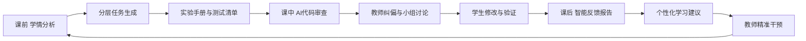

# AI教学创新设计

## 一图看懂：系统化赋能架构

  

## 核心痛点与改革目标

  

    Pain #01
    <h3>任务同质化与抄袭风险</h3>
    
统一题目导致高相似提交，难以评估学生真实能力。

  

  

    Pain #02
    <h3>审查成本高、反馈滞后</h3>
    
教师逐份人工审查压力大，反馈周期长、干预不及时。

  

  

    Pain #03
    <h3>功能完成不等于知识掌握</h3>
    
系统可运行但知识点理解薄弱，安全与规范意识不足。

  

  

    Pain #04
    <h3>统一难度无法适配分层学情</h3>
    
基础学生跟不上，强学生缺挑战，课堂参与两极分化。

  

## 课前-课中-课后闭环（Mermaid 版本）

## 角色协同矩阵

| 阶段 | AI职责 | 教师职责 | 学生职责 |
|---|---|---|---|
| 课前 | 学情分析、分层出题、手册生成 | 目标设定、难度校准、任务发布 | 预习准备、确认任务目标 |
| 课中 | 代码初审、知识点映射、测试建议 | 纠偏引导、组织讨论、过程评价 | 诊断问题、修改实现、验证解释 |
| 课后 | 反馈聚合、个性建议、薄弱点识别 | 精准干预、二次教学、任务迭代 | 二次提交、复盘反思、拓展实践 |

## 数据驱动机制

1. 数据采集：作业、测试、审查记录、课堂互动输出。
2. 数据分析：按知识点缺口、权限错误、规范问题进行聚类。
3. 反馈生成：形成小组和个人可执行建议。
4. 教学干预：针对共性问题开展定向再教学。

## 风险控制与学术诚信

1. 明确 AI 使用边界：禁止直接提交未理解代码。
2. 全流程要求“建议 -> 判断 -> 验证 -> 解释”。
3. 保留教师抽检与复核机制。
4. 截图/资料执行匿名化，确保评审合规。

## 证据映射

1. 方案总纲：`website.md`
2. 赛道映射：`网站内容映射到人工智能赛道材料.md`
3. 课堂落地：`课堂教学视频选题与AI应用方案.md`
4. 指标口径：`/data/metrics.json`
