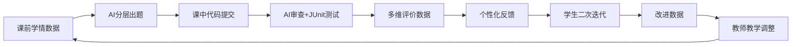

# 竞赛展示网站详细规划方案

> 语言：全站使用 **中文**，技术术语保留英文（如 Authentication、RBAC、Filter）
> 技术栈建议：基于现有 GitHub Pages + Jekyll/Hugo，或 VitePress/Docusaurus
> 部署：GitHub Pages（已有 gerryfan0706.github.io 基础）

---

## 一、网站整体结构

```
首页 (/)
├── 课程概览 (/course/)
│   ├── 课程基本信息
│   ├── 教学大纲
│   └── 教学团队
├── AI教学创新设计 (/innovation/)
│   ├── 问题与目标
│   ├── AI赋能总体架构
│   ├── 课前：个性化实验生成
│   ├── 课中：人机协同代码审查
│   ├── 课后：智能反馈与精准干预
│   └── 数据驱动闭环机制
├── 教学案例 (/cases/)
│   ├── 案例1：智能代码审查助手
│   ├── 案例2：个性化实验题目生成器
│   ├── 案例3：AI驱动课件生成
│   └── 核心案例：第15讲用户认证与权限控制
├── 成效与数据 (/results/)
│   ├── 量化成效总览
│   ├── 学生作品展示
│   ├── 对比分析
│   └── 学生反馈
├── 教学资源 (/resources/)
│   ├── 教学设计（16讲）
│   ├── AI提示词模板库
│   ├── 测试清单模板
│   └── 示例工程
├── 推广与复用 (/promotion/)
│   ├── 可复制教学模式
│   ├── 实施条件与建议
│   └── 适用课程范围
└── 关于 (/about/)
```

---

## 二、每个页面的详细内容规划

---

### 页面 1：首页 (/)

**目标**：30秒内让评委理解"这个课程做了什么、用了什么AI、效果如何"

#### 内容区块

**区块 A：Hero Banner**
- 标题：`"问题驱动 · AI赋能 · 数据闭环" —— Java Web应用开发课程AI教学创新实践`
- 副标题：太原科技大学 · Java Web应用开发 · 人工智能赛道
- 一句话定位：`构建"学情分析→个性化任务生成→人机协同实践→智能评价反馈→精准教学干预"的AI赋能教学闭环`

**区块 B：三大核心创新卡片（横向排列）**

| 卡片 | 图标 | 标题 | 描述 |
|---|---|---|---|
| 卡片1 | 🔍 | AI驱动个性化任务设计 | 一人一题，代码相似度从45%降至<5% |
| 卡片2 | 🤖 | 人机协同代码审查教学 | 学生用AI发现问题，教师引导判断验证 |
| 卡片3 | 📊 | 数据驱动智能评价反馈 | 多维评价+个性化反馈，教师审查时间减67% |

**区块 C：关键数据指标（动态计数器）**
- 代码质量提升 `30%`
- 代码相似度下降 `45% → <5%`
- SQL注入防护意识 `45% → 89%`
- 教师审查时间减少 `67%`
- 学生调试时间减少 `40%`
- 课件制作效率提升 `5-6倍`

**可视化方式**：使用 CSS 动画计数器（CountUp.js），页面滚动到该区域时触发动画

**区块 D：课前-课中-课后闭环流程图**
- 使用 Mermaid 或 SVG 绘制横向流程图
- 三列：课前 → 课中 → 课后
- 每列标注：AI做什么、教师做什么、学生做什么

```
课前                          课中                          课后
┌─────────────────┐    ┌─────────────────┐    ┌─────────────────┐
│ AI学情分析       │    │ AI代码审查助手   │    │ AI个性化反馈    │
│ AI个性化出题     │ →  │ 人机协同诊断     │ →  │ AI学习建议      │
│ AI生成实验手册   │    │ AI测试清单生成   │    │ 数据驱动干预    │
└─────────────────┘    └─────────────────┘    └─────────────────┘
  教师：查看学情          教师：引导+纠偏        教师：精准干预
  学生：完成预习          学生：操作+判断+验证    学生：迭代+反思
```

**可视化方式**：Mermaid flowchart 或自定义 SVG，配合滚动动画逐步显示

**区块 E：快速导航**
- 查看教学创新设计 →
- 查看核心教学案例 →
- 查看成效数据 →
- 下载教学资源 →

---

### 页面 2：课程概览 (/course/)

#### 2.1 课程基本信息

**以表格形式呈现：**

| 项目 | 内容 |
|---|---|
| 课程名称 | Java Web应用开发 |
| 课程性质 | 专业必修课 |
| 授课对象 | 计算机科学与技术/软件工程本科生 |
| 学时/学分 | （填入实际数据） |
| 开设学期 | （填入实际数据） |
| 主讲教师 | （匿名版留空或用代号） |
| 先修课程 | Java程序设计、数据库原理 |

#### 2.2 课程目标（列表形式）

**知识目标**：
1. 掌握 Servlet、JSP、Filter、Listener 核心技术
2. 理解 MVC 架构与三层架构（Controller-Service-DAO）
3. 掌握 Session/Cookie 管理、JDBC 数据库操作
4. 理解用户认证、授权、RBAC 等安全机制

**能力目标**：
1. 能独立完成 Java Web 项目的设计、编码、测试、部署
2. 能借助 AI 工具进行代码审查、问题诊断与知识对照
3. 能使用测试用例验证系统行为的正确性与安全性

**素养目标**：
1. 建立"默认拒绝、最小权限"的安全开发思维
2. 理解 AI 是学习辅助工具而非思考替代品
3. 养成代码规范、测试验证、持续改进的工程习惯

#### 2.3 教学内容总览

**以时间线或卡片网格展示16讲内容：**

| 讲次 | 主题 | AI应用标记 |
|---|---|---|
| 第1讲 | Web开发基础与环境搭建 | |
| 第2讲 | HTML/CSS/JavaScript基础 | |
| 第3讲 | Servlet基础 | |
| 第4讲 | 请求与响应处理 | |
| 第5讲 | JSP技术 | |
| 第6讲 | MVC架构设计 | ⭐ AI辅助架构理解 |
| 第7讲 | JDBC与数据库操作 | ⭐ AI代码审查 |
| 第8讲 | 连接池与DAO模式 | ⭐ AI代码审查 |
| 第9讲 | Session与Cookie | ⭐ AI辅助安全分析 |
| 第10讲 | Filter与Listener | ⭐ AI辅助代码审查 |
| 第11讲 | 文件上传与下载 | |
| 第12讲 | AJAX与异步交互 | |
| 第13讲 | 项目实战（一） | ⭐ AI个性化出题+代码审查 |
| 第14讲 | 项目实战（二） | ⭐ AI个性化出题+代码审查 |
| **第15讲** | **用户认证与权限控制** | **⭐⭐⭐ 核心案例讲** |
| 第16讲 | 项目部署与总结 | ⭐ AI辅助代码审查+总结 |

**可视化方式**：卡片网格布局，标有 ⭐ 的讲次卡片用不同颜色高亮，点击可跳转到对应教学设计

#### 2.4 教学大纲

- 提供教学大纲 PDF 的在线预览（embed PDF 或转为 HTML）
- 标注 AI 应用环节、数字素养培养目标、过程性评价安排

#### 2.5 工具链总览

**以图标+名称+用途的网格形式展示：**

| 工具 | 类别 | 用途 |
|---|---|---|
| Cursor | AI IDE | 代码审查、代码理解、错误诊断 |
| GPT-4 | 大语言模型 | 实验题目生成、反馈报告、内容重构 |
| Claude | 大语言模型 | 实验题目生成、PPT内容重构 |
| GitHub Copilot | AI编程辅助 | 学生代码迭代辅助 |
| JUnit 5 | 自动化测试 | 功能正确性验证 |
| Maven | 构建管理 | 项目构建与依赖管理 |
| Git/GitHub | 版本控制 | 代码管理、提交记录追踪 |
| Marp | 文档转演示 | Markdown转课件 |
| Mermaid | 图表生成 | 流程图、架构图 |
| GitHub Actions | CI/CD | 自动构建课件PDF |
| Python + OpenAI API | 自动化脚本 | 批量生成个性化实验手册 |
| 自研平台 | 教学管理 | 实验题目分发与数据追踪 |

**可视化方式**：工具图标网格，鼠标悬停显示详细说明

---

### 页面 3：AI教学创新设计 (/innovation/)

**这是最核心的页面，对应"创新成果报告"的内容**

#### 3.1 真实问题（问题导向）

**以"痛点卡片"形式呈现4个核心问题：**

**问题1：实验题目同质化严重，抄袭率高**
- 数据：约45%的学生代码相似度>80%，其中23%几乎完全相同
- 来源：同学互抄、网络现成方案、GitHub直接fork
- 后果：无法评估学生真实能力，优秀学生无挑战

**问题2：教师逐一审查不现实，反馈严重滞后**
- 数据：教师人均审查一份项目代码需要X分钟
- 痛点：40人班级 × X分钟 = 难以实现逐一精细反馈
- 后果：学生拿到分数但不知道哪里有问题

**问题3：完成功能 ≠ 掌握知识点**
- 现象：学生能让系统"跑起来"，但不理解认证vs授权、Session生命周期、Filter机制
- 后果：传统结果评价无法识别"能运行但不安全/不规范"的代码

**问题4：统一难度无法适配分层学情**
- 现象：基础薄弱的学生完不成，能力强的学生吃不饱
- 后果：两极分化加剧，课堂参与度下降

**可视化方式**：四张卡片，每张包含问题标题、关键数据（红色高亮）、痛点描述。配合图标（❌ 或警告图标）

#### 3.2 改革目标

**以目标-路径对照表呈现：**

| 改革目标 | 实现路径 |
|---|---|
| 消除实验抄袭 | AI一人一题，同知识点不同场景 |
| 实现精准反馈 | AI代码审查+知识点对照+个性化建议 |
| 从结果评价转向过程评价 | 多维智能评价（测试+审查+知识对照） |
| 适配分层学情 | 三级难度（基础/进阶/挑战）个性化任务 |
| 培养安全开发思维 | 问题驱动+AI辅助诊断+验证闭环 |

#### 3.3 AI赋能总体架构图

**这是全页最重要的一张图，建议精心制作**

```
┌─────────────────────────────────────────────────────────────────┐
│                    AI赋能Java Web教学闭环模型                      │
│                                                                   │
│   ┌──────────┐      ┌──────────────┐      ┌──────────────┐      │
│   │  课 前    │      │   课  中      │      │   课  后      │      │
│   │          │      │              │      │              │      │
│   │ 学情分析  │ ───→ │ 问题驱动导入  │ ───→ │ AI反馈报告   │      │
│   │ ↓        │      │ ↓            │      │ ↓            │      │
│   │ AI分层   │      │ 分组AI代码审查│      │ 个性化建议   │      │
│   │ ↓        │      │ ↓            │      │ ↓            │      │
│   │ 个性化出题│      │ 汇报+知识对照 │      │ 二次迭代     │      │
│   │ ↓        │      │ ↓            │      │ ↓            │      │
│   │ 生成手册  │      │ 修改+测试验证 │      │ 数据驱动干预 │      │
│   └──────────┘      └──────────────┘      └──────────────┘      │
│        ↑                                         │               │
│        └─────────── 数据反哺下一轮教学 ←──────────┘               │
└─────────────────────────────────────────────────────────────────┘
```

**可视化方式**：使用 Mermaid 绘制，或制作自定义 SVG/CSS 动画。建议配合颜色编码：
- 蓝色 = AI执行的环节
- 绿色 = 教师主导的环节
- 橙色 = 学生参与的环节

#### 3.4 课前：个性化实验生成（详细子页）

**内容：**

1. **学情数据采集**
   - 数据来源：历史作业成绩、测试分数、知识点掌握情况
   - 分层依据：将学生分为基础/进阶/挑战三个层级
   - 展示内容：学生分层示意图（匿名化）

2. **AI个性化出题流程**
   - 流程图：学生名单CSV → Python脚本(OpenAI API) → Markdown实验手册 → pandoc转PDF
   - 时间对比：传统手工出题数天 vs AI批量生成15-20分钟
   - 展示内容：3份不同难度的实验手册样例（基础/进阶/挑战）

3. **三级难度设计**

   | 等级 | 模块数 | 提供内容 | 要求 |
   |---|---|---|---|
   | 基础（绿色） | 3-4个 | 代码框架+完整SQL脚本 | 补全关键代码 |
   | 进阶（蓝色） | 5-6个 | 接口定义 | 独立设计实现 |
   | 挑战（橙色） | 7-8个 | 需求描述 | 完整架构设计+性能测试 |

4. **12个业务场景池**（防跨学期重复）
   - 图书借阅系统、选课系统、失物招领、宿舍报修、实验室预约、社团管理、兼职平台、二手交易、教室借用、志愿者管理、校园跑腿、问卷平台
   - 展示方式：场景卡片网格

5. **评分标准自动生成**
   - 功能实现（30-40%）、知识点应用（20-30%）、代码质量（15-20%）、逻辑正确性（20-25%）
   - 进阶/挑战层额外：界面设计(5%)、安全优化(5%)、最高+20奖励分

**可视化方式**：
- 出题流程用 Mermaid sequence diagram
- 三级难度用颜色编码卡片
- 场景池用图标网格
- 时间对比用柱状图（Chart.js 或 ECharts）

#### 3.5 课中：人机协同代码审查教学

**内容：**

1. **教学模式定义**
   - 一句话：`"教师主导、学生主体、AI协同"的三方协作教学模式`
   - AI角色界定（重要）：
     - AI **不是**：代码生成器、答案提供者、教师替代品
     - AI **是**：代码审查助手、知识点对照工具、测试清单生成器、个性化反馈引擎

2. **核心教学案例：第15讲**
   - 链接到案例详情页
   - 简要流程：问题系统演示 → 分组AI审查 → 汇报知识对照 → 修改验证 → 闭环总结

3. **Cursor使用场景**（配截图）
   - 代码理解：Ctrl+L 打开对话，询问"这段代码做了什么"
   - 错误诊断：Ctrl+K 选中错误代码，获取修复建议
   - 代码审查：要求审查 Servlet 的安全性、性能、最佳实践
   - 知识点对照：将AI输出与课程知识点逐项对应

4. **知识点验证清单（8项）**
   - Servlet基础与生命周期
   - 请求与响应处理
   - MVC模式（Controller-Service-DAO三层架构）
   - 数据库连接与JDBC（PreparedStatement、try-with-resources、连接池）
   - Session与Cookie管理
   - 异常处理与日志
   - 安全（输入验证、加密、XSS防护）
   - Filter和Listener

5. **AI提示词模板展示**
   - 展示7个核心提示词（教师总控、A/B/C组、知识对照、修改建议、教师纠偏）
   - 每个提示词配使用场景说明

**可视化方式**：
- 教学流程用时间轴（timeline）组件
- AI角色界定用对比卡片（✗ vs ✓）
- Cursor截图用带标注的图片（箭头指向关键操作）
- 提示词用可折叠的代码块

#### 3.6 课后：智能反馈与精准干预

**内容：**

1. **AI反馈报告生成**
   - 输入：学生提交代码 + Cursor审查结果 + JUnit测试结果 + 知识点对照
   - 输出：个性化反馈报告（问题说明、改进建议、学习资源推荐）
   - 展示内容：一份样例反馈报告（匿名化）

2. **学生二次迭代**
   - 流程：收到反馈 → 理解问题 → 借助Cursor修改 → 重新提交
   - 展示内容：一个学生修改前后的代码对比（匿名化）

3. **数据驱动教学干预**
   - 教师通过数据识别共性薄弱点
   - 下一次课堂针对性加强
   - 展示内容：数据看板示意图

4. **课后拓展任务（AI生成）**
   - 基础任务：升级密码哈希至BCrypt
   - 进阶任务：增加MANAGER角色
   - 挑战任务：增强Session安全机制

**可视化方式**：
- 反馈流程用 Mermaid flowchart
- 代码对比用 diff 展示组件（类似 GitHub diff）
- 数据看板用模拟图表

#### 3.7 数据驱动闭环机制

**专门一个子页展示数据如何流转：**



**说明每个环节采集的数据类型：**

| 环节 | 采集数据 | 用途 |
|---|---|---|
| 课前 | 历史成绩、测试分数、知识掌握度 | 学生分层、难度匹配 |
| 课中 | AI审查结果、代码修改记录、测试通过率 | 实时教学调控 |
| 课后 | 反馈报告、二次提交质量、知识点补强情况 | 精准干预、教学改进 |

**可视化方式**：Mermaid 循环图 + 数据流表格

#### 3.8 学术诚信与AI使用规范

**必须包含此部分（评委重点关注）**

**内容：**

1. **AI使用边界**
   - 允许：代码审查、问题诊断、知识对照、测试生成
   - 禁止：直接复制AI生成的完整代码提交、用AI替代独立思考
   - 原则：AI输出是"起点"不是"结论"，必须经过学生判断和系统验证

2. **防抄袭措施**
   - 一人一题机制（从任务设计源头抑制抄袭）
   - 代码相似度检测
   - AI交互日志审计

3. **数据安全与隐私**
   - 学生数据匿名化处理
   - AI平台数据不外泄
   - 遵循学校数据管理规范

4. **教师审核机制**
   - AI反馈报告需教师抽检确认
   - 关键教学决策由教师做出
   - AI是工具不是决策者

**可视化方式**：规则清单 + 允许/禁止对比表

---

### 页面 4：教学案例 (/cases/)

#### 4.1 案例总览页

三张大卡片 + 一张核心案例卡片，每张包含：
- 案例名称
- 一句话描述
- 关键数据指标
- "查看详情"按钮

#### 4.2 案例1：智能代码审查助手 (/cases/code-review/)

**可从现有 Workshop 页面迁移并扩充**

**页面结构：**

1. **问题背景**
   - 学生调试效率低
   - 教师批改负担重
   - 完成功能≠掌握知识点
   - 传统评价重结果轻过程

2. **解决方案**
   - 6步工作流（详细流程图）：
     1. 学生完成项目模块，推送至GitHub
     2. Cursor AI初步审查（Ctrl+K / Cmd+K）
     3. 运行预设JUnit 5测试用例
     4. 课程大纲知识点交叉验证
     5. 生成综合反馈报告（Cursor + ChatGPT）
     6. 学生迭代修改
   - 可视化方式：Mermaid sequence diagram

3. **AI提示词模板**（可折叠展示）
   - UserServlet 审查提示词（知识点应用、代码质量、安全性、性能四个维度）
   - 输出格式要求

4. **知识点验证清单**（表格）
   - 8个知识点 × 检查要求 × 加分项

5. **测试用例示例**（代码块展示）
   - 有效登录测试
   - SQL注入防护测试
   - 密码加密存储测试
   - Session管理测试

6. **成效数据**
   - 代码质量提升30%
   - 规范性提升37%
   - SQL注入意识45%→89%
   - 教师审查时间减67%
   - 学生调试时间减40%
   - 可视化方式：ECharts/Chart.js 柱状图 + 折线图

#### 4.3 案例2：个性化实验题目生成器 (/cases/experiment/)

**可从现有 Workshop 页面迁移并扩充**

**页面结构：**

1. **问题背景**
   - 45%学生代码相似度>80%
   - 23%几乎完全相同
   - 抄袭来源分析

2. **解决方案**
   - 一人一题机制
   - 三级难度设计（基础/进阶/挑战）
   - 6步AI生成流程

3. **实验手册样例**（3份，分别对应三个难度）
   - 基础：简易图书借阅系统
   - 进阶：在线选课系统
   - 挑战：智能实验室预约平台
   - 展示方式：Tab切换或卡片切换

4. **自动化流程**
   - Python脚本 → OpenAI API → Markdown → pandoc → PDF
   - 代码片段展示
   - 时间对比：数天 → 15-20分钟

5. **成效数据**
   - 代码相似度 45% → <5%
   - 可视化方式：对比柱状图（改革前 vs 改革后），用红色→绿色渐变

#### 4.4 案例3：AI驱动课件生成 (/cases/ppt/)

**可从现有 Workshop 页面迁移**

**页面结构：**

1. 两条技术路线：LaTeX Beamer vs Markdown + Marp
2. 8步工作流
3. Cursor提示词模板
4. GitHub Actions自动化配置
5. 效率提升：3-4小时 → 30-40分钟

#### 4.5 核心案例：第15讲用户认证与权限控制 (/cases/lecture15/)

**这是最重要的案例页面，对应课堂教学实录视频内容**

**页面结构：**

1. **课程定位**
   - 核心问题：`"能登录 ≠ 安全系统"`
   - 教学目标：知识目标（4条）+ 能力目标（4条）+ 素养目标（2条）
   - 完整列出，与教案保持一致

2. **示例工程介绍**
   - 课题作业管理系统
   - 预设账户：admin/ADMIN、tom/USER
   - 系统功能：登录、首页、管理后台
   - **3个预埋缺陷**（用警告色高亮）：
     1. RoleBasedAuthFilter只查登录不查角色（授权缺陷）
     2. JSP菜单仅按登录状态显示，不按角色过滤（视图不一致）
     3. LogoutServlet只删属性不销毁Session（会话残留）

   **可视化方式**：项目结构树 + 缺陷位置标注（类似代码中的红色波浪线）

3. **45分钟课堂流程（时间轴）**

   使用交互式时间轴展示：

   | 时间段 | 环节 | 教师活动 | 学生活动 | AI角色 |
   |---|---|---|---|---|
   | 0-2min | 问题导入 | 展示系统，提出核心问题 | 观察系统行为 | - |
   | 2-5min | 认知冲突 | 演示tom访问管理后台 | 发现"能进去！" | - |
   | 5-8min | 目标+分组 | 布置ABC组任务 | 明确分工 | - |
   | 8-10min | 知识回顾 | 3个快速提问 | 回答Session/Filter/前端安全 | - |
   | 10-13min | AI演示 | 示范一次AI代码审查 | 观察AI输出 | 代码审查助手 |
   | 13-20min | 分组审查 | 巡回指导 | 各组用AI审查对应代码 | 分组代码审查 |
   | 20-26min | 小组汇报 | 点评+知识对照 | 报告发现+判断 | - |
   | 26-30min | 知识升华 | 板书5大知识点对照 | 理解认证vs授权 | - |
   | 30-35min | 代码修改 | 巡回指导 | 修改核心缺陷 | 修改建议参考 |
   | 35-39min | 测试验证 | 引导验证 | AI生成测试清单+逐项验证 | 测试清单生成 |
   | 39-42min | 结果展示 | 重新演示3条路径 | 确认系统安全 | - |
   | 42-45min | 总结+拓展 | 三点总结+课后任务 | 记录拓展任务 | 课后任务生成 |

   **可视化方式**：交互式垂直时间轴（点击每个阶段展开详细描述），配合颜色编码标识AI参与的环节

4. **分组任务设计**

   三张卡片并排：

   **A组：认证组**
   - 审查文件：`LoginServlet.java`、`LogoutServlet.java`
   - 关注点：Session存储是否正确、登出是否彻底、会话残留
   - AI提示词：（展示完整提示词）
   - 预期发现：logout只removeAttribute不invalidate

   **B组：授权组**
   - 审查文件：`RoleBasedAuthFilter.java`
   - 关注点：是否只查登录不查角色、普通用户能否访问/admin/*
   - AI提示词：（展示完整提示词）
   - 预期发现：Filter只判断user!=null，未判断role

   **C组：视图一致性组**
   - 审查文件：JSP菜单渲染代码
   - 关注点：菜单是否按角色显示、前端隐藏≠后端安全
   - AI提示词：（展示完整提示词）
   - 预期发现：菜单只判断user!=null，不判断role

   **可视化方式**：三列卡片布局，每列不同颜色（A=蓝色/认证、B=红色/授权、C=绿色/视图）

5. **修复前后对比**

   **展示三段关键代码的修复前后对比：**

   **RoleBasedAuthFilter（修复前 vs 修复后）**
   ```java
   // 修复前：只查登录
   if (u != null) {
       chain.doFilter(req, res);
   }

   // 修复后：查登录+查角色
   if (u != null && "ADMIN".equals(u.getRole())) {
       chain.doFilter(req, res);
   } else {
       response.sendError(403);
   }
   ```

   **JSP菜单（修复前 vs 修复后）**
   ```jsp
   <%-- 修复前：登录即显示 --%>
   <c:if test="${sessionScope.user != null}">
       <a href="admin/panel.jsp">管理后台</a>
   </c:if>

   <%-- 修复后：ADMIN才显示 --%>
   <c:if test="${sessionScope.user.role == 'ADMIN'}">
       <a href="admin/panel.jsp">管理后台</a>
   </c:if>
   ```

   **LogoutServlet（修复前 vs 修复后）**
   ```java
   // 修复前：只删属性
   session.removeAttribute("user");

   // 修复后：销毁整个Session
   if (session != null) {
       session.invalidate();
   }
   ```

   **可视化方式**：并排代码块（左红右绿），类似 GitHub diff 风格

6. **测试验证清单**

   展示完成修复后的验证结果：

   | 测试项 | 操作 | 预期结果 | 实际结果 |
   |---|---|---|---|
   | T1 | 未登录访问 /admin/panel | 拦截/重定向 | ✅ 通过 |
   | T2 | tom/USER 访问 /admin/panel | 拒绝/403 | ✅ 通过 |
   | T3 | admin/ADMIN 访问 /admin/panel | 正常进入 | ✅ 通过 |
   | T4 | 退出后再访问 /admin/panel | 再次拦截 | ✅ 通过 |
   | T5 | tom/USER 首页菜单 | 无"管理后台"入口 | ✅ 通过 |
   | T6 | admin/ADMIN 首页菜单 | 显示"管理后台"入口 | ✅ 通过 |

   **可视化方式**：表格，通过项用绿色 ✅，未通过用红色 ❌

7. **板书内容**
   ```
   Authentication → 你是谁
   Authorization  → 你能做什么
   Session        → 保存登录状态
   Filter         → 统一控制入口
   RBAC           → 按角色授权
   ```

---

### 页面 5：成效与数据 (/results/)

**这是评委最关注的"证据页面"**

#### 5.1 量化成效总览（数据大屏风格）

**以仪表盘形式展示所有关键指标：**

**第一行：代码质量指标**
- 代码质量提升：`+30%`（环形进度图）
- 代码规范性提升：`+37%`（环形进度图）
- SQL注入防护意识：`45% → 89%`（渐变进度条）

**第二行：效率指标**
- 教师审查时间：`-67%`（对比柱状图：改革前 vs 改革后）
- 学生调试时间：`-40%`（对比柱状图）
- 课件制作效率：`5-6倍`（对比柱状图：3-4h vs 30-40min）

**第三行：抄袭治理**
- 代码相似度：`45% → <5%`（面积图，展示趋势下降）
- 高度雷同比例：`23% → ~0%`

**第四行：个性化教学**
- 个性化题目生成时间：`数天 → 15-20分钟`
- 12个业务场景池
- 三级难度覆盖全部学生

**可视化方式**：ECharts 或 Chart.js
- 环形进度图（gauge chart）展示百分比提升
- 柱状图（bar chart）展示前后对比
- 面积图（area chart）展示趋势变化
- 计数器动画展示关键数字
- 配色建议：改革前=灰色/红色，改革后=蓝色/绿色

#### 5.2 对比分析

**改革前 vs 改革后的系统对比表：**

| 维度 | 改革前 | 改革后 |
|---|---|---|
| 实验题目 | 全班统一题目 | 一人一题，三级难度 |
| 代码审查 | 教师人工逐一审查 | AI初审+教师抽检 |
| 反馈速度 | 数天后返回成绩 | 即时AI反馈+教师补充 |
| 评价维度 | 功能是否实现 | 功能+知识点+质量+安全+规范 |
| 抄袭率 | ~45%高度相似 | <5%相似 |
| 学生参与 | 被动接收反馈 | 主动使用AI诊断+判断+验证 |
| 教师角色 | 知识传授者+批改者 | 教学设计者+引导者+干预者 |

**可视化方式**：双列对比卡片，左侧（红/灰色）vs 右侧（绿/蓝色），配合箭头或动画转变效果

#### 5.3 学生作品展示

**展示3-5份匿名化的学生作品样例：**

1. **基础层学生作品**
   - 题目：简易图书借阅系统
   - AI审查前的代码片段（问题标注）
   - AI反馈报告摘录
   - 修改后的代码片段
   - 测试通过截图

2. **进阶层学生作品**
   - 题目：在线选课系统
   - 类似展示

3. **挑战层学生作品**
   - 题目：智能实验室预约平台
   - 类似展示

**可视化方式**：Tab切换或轮播卡片，每个作品包含代码diff + 测试结果

#### 5.4 学生反馈

**建议收集并展示：**

1. **问卷数据**（如有）
   - AI辅助教学满意度
   - 对代码审查助手的评价
   - 对个性化出题的评价
   - 学习效果自评
   - 可视化方式：饼图/条形图

2. **学生代表性评语**（匿名化）
   - 精选5-8条有代表性的学生反馈
   - 展示方式：引用卡片

3. **教学评教数据**（如有）
   - 课程整体评分
   - 与往年对比

---

### 页面 6：教学资源 (/resources/)

#### 6.1 教学设计（16讲）

**以卡片网格展示：**
- 每张卡片：讲次编号 + 主题 + AI应用标记
- 点击下载对应教学设计PDF
- 第15讲特别标注为核心案例

#### 6.2 AI提示词模板库

**按用途分类展示所有提示词：**

**分类一：代码审查类（7个）**
1. 教师总控审查提示词
2. A组认证审查提示词
3. B组授权审查提示词
4. C组视图一致性审查提示词
5. 知识点对照提示词
6. 精细化修改建议提示词
7. 教师纠偏提示词

**分类二：测试生成类（3个）**
1. 最小验证清单生成提示词
2. 手工测试用例生成提示词
3. 回归测试清单提示词

**分类三：课后评价类（3个）**
1. 小组反馈生成提示词
2. 个性化学习建议提示词
3. 递进式课后拓展任务提示词

**分类四：AI输出纠偏类（4个）**
1. AI输出太笼统时的追问提示词
2. AI直接给整段代码时的引导提示词
3. AI未对照知识点时的补充提示词
4. AI忽略验证时的追加提示词

**展示方式**：每个提示词用可折叠/展开的代码块，配使用场景标签和使用时机说明。提供"一键复制"按钮。

#### 6.3 测试清单模板

展示3套预制测试清单：
- 清单A：核心权限验证（6项）
- 清单B：视图与后端一致性（4项）
- 清单C：Session行为验证（3项）

提供可下载的 Markdown/PDF 版本。

#### 6.4 示例工程

- 链接到 GitHub 仓库（问题版 + 修复版）
- 项目结构说明
- 部署运行指南（README）
- 预设账户信息

---

### 页面 7：推广与复用 (/promotion/)

#### 7.1 可复制的教学模式

**用一张模式图概括：**

```
"AI赋能编程类课程教学"三位一体模式
┌──────────────────────────────────────┐
│  AI个性化任务设计                       │
│  + AI辅助知识对照与代码审查              │
│  + 数据驱动多维评价反馈                  │
│  = 课前-课中-课后AI赋能教学闭环          │
└──────────────────────────────────────┘
```

#### 7.2 实施条件

| 条件 | 最低要求 | 推荐配置 |
|---|---|---|
| AI工具 | 任一AI对话工具（如ChatGPT、Claude） | Cursor IDE + GPT-4 API |
| 学生设备 | 能上网的电脑 | 人手一台开发环境 |
| 教师能力 | 基本AI提示词使用 | 能设计提示词模板+评价标准 |
| 课程类型 | 任何编程实践类课程 | 有项目实践环节的课程 |
| 班级规模 | 10-60人 | 30-40人最佳 |

#### 7.3 适用课程范围

- Java Web应用开发 ✓（已验证）
- Python程序设计 ✓（可直接迁移）
- 数据结构与算法 ✓（代码审查+测试验证）
- 数据库原理（实验） ✓（SQL审查+个性化出题）
- 软件工程（实践） ✓（项目审查+多维评价）
- 编译原理（实验） ✓
- 操作系统（实验） ✓

#### 7.4 推广成果

- Workshop网站已公开（链接）
- 提示词模板库可复用
- 示例工程代码开源
- 自动化出题脚本可复用

---

### 页面 8：关于 (/about/)

- 课程信息
- 联系方式
- 致谢
- （匿名版隐去个人信息）

---

## 三、需要准备的文档和素材清单

### 必须准备的截图

| 编号 | 截图内容 | 用于页面 | 匿名化要求 |
|---|---|---|---|
| S01 | Cursor Chat 代码审查界面 | 案例1、第15讲 | 隐去账号信息 |
| S02 | Cursor Ctrl+K 错误诊断界面 | 案例1 | 隐去账号信息 |
| S03 | GPT-4 实验题目生成对话 | 案例2 | 隐去账号信息 |
| S04 | 自研平台题目分发界面 | 案例2 | 隐去姓名学号 |
| S05 | 自研平台数据统计面板 | 成效数据 | 隐去姓名学号 |
| S06 | JUnit 测试运行结果 | 案例1、第15讲 | 无需 |
| S07 | GitHub 学生代码仓库 | 案例1 | 隐去用户名 |
| S08 | GitHub Actions 构建日志 | 案例3 | 无需 |
| S09 | 学生使用Cursor的课堂照片 | 第15讲 | 面部模糊 |
| S10 | 分组讨论课堂照片 | 第15讲 | 面部模糊 |
| S11 | 教务系统课程截图 | 课程概览 | 隐去教师姓名 |
| S12 | Workshop网站首页截图 | 推广 | 无需 |

### 必须准备的文档

| 编号 | 文档 | 格式 | 用于页面 |
|---|---|---|---|
| D01 | 教学大纲 | PDF | 课程概览 |
| D02 | 第15讲教案（标注AI环节） | PDF | 第15讲案例 |
| D03 | 第15讲课件（标注AI环节） | PDF | 第15讲案例 |
| D04 | 基础层实验手册样例 | PDF | 案例2 |
| D05 | 进阶层实验手册样例 | PDF | 案例2 |
| D06 | 挑战层实验手册样例 | PDF | 案例2 |
| D07 | AI反馈报告样例（匿名化） | PDF | 课后反馈 |
| D08 | 学生代码修改前后对比（匿名化） | 代码文件 | 学生作品 |
| D09 | 学生问卷调查结果 | 数据/图表 | 学生反馈 |
| D10 | 示例工程源码（问题版） | GitHub仓库 | 教学资源 |
| D11 | 示例工程源码（修复版） | GitHub仓库 | 教学资源 |

### 必须准备的数据图表

| 编号 | 图表内容 | 图表类型 | 工具建议 |
|---|---|---|---|
| C01 | 代码质量提升前后对比 | 柱状图 | ECharts / Chart.js |
| C02 | 代码规范性提升前后对比 | 柱状图 | ECharts / Chart.js |
| C03 | SQL注入意识变化 | 折线图/对比柱状图 | ECharts / Chart.js |
| C04 | 代码相似度下降趋势 | 面积图 | ECharts / Chart.js |
| C05 | 教师审查时间对比 | 水平柱状图 | ECharts / Chart.js |
| C06 | 学生调试时间对比 | 水平柱状图 | ECharts / Chart.js |
| C07 | 课件制作效率对比 | 柱状图 | ECharts / Chart.js |
| C08 | 学生分层分布饼图 | 饼图 | ECharts / Chart.js |
| C09 | 问卷调查结果 | 条形图/雷达图 | ECharts / Chart.js |
| C10 | 课前-课中-课后AI赋能闭环 | 流程图 | Mermaid / 自定义SVG |
| C11 | 数据驱动闭环机制 | 循环图 | Mermaid / 自定义SVG |
| C12 | 45分钟课堂时间轴 | 时间轴 | 自定义CSS组件 |

---

## 四、可视化方法总结

| 内容类型 | 推荐可视化方法 | 技术工具 |
|---|---|---|
| 量化数据对比 | 柱状图、折线图、面积图 | ECharts / Chart.js |
| 百分比指标 | 环形进度图、进度条 | ECharts gauge / CSS |
| 关键数字 | 动态计数器 | CountUp.js |
| 流程/架构 | 流程图、循环图 | Mermaid / 自定义SVG |
| 时间线 | 垂直/水平时间轴 | 自定义CSS组件 |
| 代码对比 | Diff展示 | Prism.js + diff插件 |
| 分类信息 | 卡片网格、Tab切换 | CSS Grid / Flexbox |
| 提示词模板 | 可折叠代码块+复制按钮 | highlight.js + clipboard.js |
| 前后对比 | 双列卡片（红→绿） | CSS Grid |
| 饼图/雷达图 | 分布/多维评价 | ECharts / Chart.js |
| 项目结构 | 目录树 | 自定义CSS tree |
| 截图/照片 | 带标注的图片展示 | Lightbox / 自定义组件 |

---

## 五、页面优先级与开发顺序

| 优先级 | 页面 | 理由 |
|---|---|---|
| P0 | 首页 | 第一印象，概括全局 |
| P0 | AI教学创新设计 | 对应创新成果报告核心内容 |
| P0 | 核心案例：第15讲 | 对应课堂教学视频 |
| P1 | 成效与数据 | 评委最关注的证据 |
| P1 | 案例1：代码审查 | 核心AI应用 |
| P1 | 案例2：个性化实验 | 核心AI应用 |
| P2 | 教学资源 | 提示词库+工程代码 |
| P2 | 推广与复用 | 评分加分项 |
| P3 | 课程概览 | 基础信息 |
| P3 | 案例3：PPT生成 | 辅助案例 |
| P3 | 关于 | 基础页面 |

---

## 六、与竞赛材料的对应关系

| 竞赛材料 | 网站对应页面 | 作用 |
|---|---|---|
| 人工智能创新成果报告 | AI教学创新设计（全部子页） | 报告内容的可视化呈现 |
| 课堂教学实录视频 | 核心案例：第15讲 | 视频内容的补充说明 |
| 课外教学展示视频 | 案例1+案例2+成效数据 | 课前课后环节的详细展示 |
| 教案 | 教学资源 | 在线查看+下载 |
| 课件 | 教学资源 | 在线查看+下载 |
| AI应用证明材料 | 全站截图+案例页 | 整合所有AI使用证据 |
| 创新成果支撑材料 | 成效与数据 | 量化证据的可视化 |
| 推广价值 | 推广与复用 + 网站本身 | 网站本身就是推广载体 |

---

## 七、注意事项

1. **匿名化**：网站需要准备两个版本——原始版（含教师信息）和匿名版（评审用）
2. **移动端适配**：评委可能用手机查看，确保响应式设计
3. **加载速度**：图片压缩、懒加载，避免大文件拖慢速度
4. **SEO无关**：竞赛网站不需要SEO优化，专注内容质量
5. **离线备份**：除在线版外，准备一份可离线运行的静态HTML备份，以防网络问题
6. **PDF导出**：关键页面（如创新设计、成效数据）建议可导出PDF，用于提交材料附件
