# 人工智能创新成果报告

## 摘要

《Java Web应用开发》课程长期面临代码抄袭泛滥（MOSS相似度45%）、教师反馈滞后2—3周、团队搭便车无法监控、学生盲信AI缺乏批判性思维、教师备课重复低效六大真实问题。本课程构建了**五维AI融合创新体系**——智能助教（RAG课程智能体）、AI自适应编程挑战（安全攻防闯关）、团队协作教练（Git数据分析）、人机对抗（Code Review Battle）、AI辅助教学资料重构（一人一题+AI课件生成），形成"课前学情采集与个性化任务生成→课中游戏化训练与人机对抗→课后智能评价与精准干预"的全流程数据闭环，覆盖**全部六大AI教学情境**。五维工具全部使用国产大模型（DeepSeek/通义千问），部署于校内服务器。

经准实验对照（实验组N=58 vs 对照组N=62，同教师/教材/环境），核心成效包括：代码编译通过率+21.2pp（p<0.001, d=0.76）、安全漏洞数-2.2个/份（d=1.69）、SQL注入识别率从12.1%跃升至89.7%、代码相似度从45%降至<5%（高相似对数47→0）、教师审查时间-63.7%。问卷显示92.6%学生愿意继续使用，83.4%认为AI建议需要批判性判断。

## 一、课程基本情况与学生特点

《Java Web应用开发》为计算机科学与技术专业核心实践课程，面向大三学生，32学时（理论24+实验8），每学期约60人。课程以Servlet、JSP、JDBC、会话管理、MVC架构、Filter/Listener、三层架构、权限控制为主线，共16讲，目标是培养学生Web开发工程实践能力、安全编码意识和AI辅助开发素养。课程采用"Java Web程序设计"（清华大学出版社第3版）为教材，实验环境统一为JDK 8 + Tomcat 9 + MySQL 8.0 + IntelliJ IDEA。

### 学情诊断

基于入学摸底测试（第1周纸质测试+在线调查）与2024秋学期历史数据，识别出以下学情特征：

**①编程基础分层明显。** 通过前导课程（Java程序设计、数据库原理）成绩分析，将学生分为三层：A层（基础扎实，前导课程均分≥85）约20%、B层（基本掌握，均分70-84）约60%、C层（基础薄弱，均分<70）约20%。三层学生在面对综合性Web开发任务时表现差异显著——A层能独立完成基本CRUD，C层连Servlet生命周期都难以理解。

**②安全意识极弱。** 首周摸底测试设计了4道SQL注入相关题目（3道判断+1道代码改写），结果令人警醒：SQL注入识别率仅12.1%（7/58），其中"判断字符串拼接SQL是否有安全风险"正确率19.0%（11/58），"解释`admin' --`攻击效果"正确率仅8.6%（5/58），PreparedStatement正确使用率仅5.2%（3/58）——绝大多数学生根本不知道PreparedStatement的存在。这一数据表明，学生在学习Web开发之前几乎没有安全编码意识。

**③作业抄袭普遍。** 2024秋学期MOSS检测全班平均代码相似度45.2%，高相似度（>60%）配对达47对（占全部C(62,2)=1891对的2.5%）。以JSP页面作业（HW03）为例，47对高相似度代码中有31对来自同一宿舍，呈现明显的"代码传播链"——一人完成后通过即时通讯工具传递给同学，经简单修改变量名后提交。

**④重"能运行"轻"写得好"。** 首次提交编译通过率67.3%，表面上完成度尚可，但深入分析发现：异常处理覆盖率仅31.5%（大量裸的`catch(Exception e){}`空块）、命名规范符合率仅54.2%（类名小写、变量用`s`/`u1`等无意义缩写）、分层架构合规率仅38.1%（Servlet中直接写SQL语句）。学生满足于"程序能跑就行"，缺乏工程化编码意识。

## 二、教学中的真实问题与原因分析

**问题一：实验题目同质化导致代码高度相似。** 传统统一题目下，MOSS检测每次作业平均47对代码相似度>60%。以2024秋第6次作业（JDBC数据库操作）为例，全班62人使用完全相同的数据表结构（users表5个字段）和功能要求（增删改查），导致代码结构高度趋同。即使不主动抄袭，题目的同质性也使得独立完成的代码在结构上高度相似，MOSS检测难以区分"抄袭"与"殊途同归"。根因：题目设计缺乏差异化，完成路径单一，学生没有"必须自己做"的内在驱动。

**问题二：教师反馈严重滞后。** 单次62份作业（2024秋）审查耗时约33.9小时（32.8min/份），其中代码规范检查8.2min、功能正确性测试12.5min、安全漏洞审查6.8min、反馈意见撰写5.3min。按每周审查一批、每天可用3小时计算，一批作业需11个工作日才能完成反馈，反馈滞后2—3周。学生在收到反馈时已开始下一个实验主题，错过最佳纠错窗口，同类错误在后续作业中反复出现。根因：人工逐份审查效率瓶颈——教师既要检查功能、又要审查规范和安全，四个环节串行执行，无法并行加速。

**问题三：评价维度单一，安全与规范被忽视。** 传统评价以"功能能否运行"为唯一标准——能增删改查就算合格。这种评价导向下，学生不关注代码质量：56.5%的学生在权限控制作业中使用字符串拼接SQL（存在SQL注入漏洞），71.0%的学生缺少Filter角色检查（存在越权访问风险），48.4%的学生注销时未清除Session（存在Session残留风险），41.9%的学生输出页面未做HTML转义（存在XSS风险）。根因：缺乏多维评价标准和自动化评估工具，教师在有限时间内只能优先检查功能正确性。

**问题四：团队项目中搭便车难以监控。** 团队项目是课程重要组成部分，但传统评价仅看最终成果，无法准确评估每位成员的实际贡献。2024秋学期10个团队项目中，教师通过答辩问询主观判断存在3-5名搭便车学生，但缺乏客观数据支撑，无法及早干预。根因：缺少过程性团队协作监控手段，教师仅能通过期末答辩了解分工情况，错过了项目中期纠偏的最佳时机。

**问题五：学生盲信AI输出，缺乏批判性思维。** 随着ChatGPT等工具普及，学生在编程中越来越依赖AI生成代码，但普遍缺乏对AI输出的批判性评估能力。2024秋学期课堂观察发现：超过60%的学生在使用AI辅助编程时直接采纳AI建议而不加验证，部分学生甚至将AI生成的错误代码直接提交——"AI说的就是对的"成为隐性共识。期末问卷中仅16.7%的学生认为AI建议"需要批判性判断"。根因：传统教学缺乏系统性的人机协作训练场景，学生没有机会亲历"AI也会犯错"的认知冲突，无法建立"信任但验证"的AI使用习惯。

**问题六：教师备课重复低效，个性化教学资源匮乏。** 每讲PPT制作耗时约4小时，16讲共64+小时，挤占了教学设计与学生辅导时间。更关键的是，传统统一实验手册无法适配分层学情——A层学生觉得太简单、C层学生觉得太难，但教师没有精力为不同层次学生分别设计实验。根因：教学资源生产完全依赖人工，缺乏AI辅助的个性化资源生成能力。

## 三、AI赋能的总体设计思路

针对五大问题，构建"**学情分析→个性化任务→人机协同→智能评价→精准干预**"五环闭环（见图1），核心原则为**AI辅助不替代**——AI担任"智能助教""攻防教练""团队监督""评审对手""资料重构引擎"五个角色，理解、判断和修改的主体始终是学生。

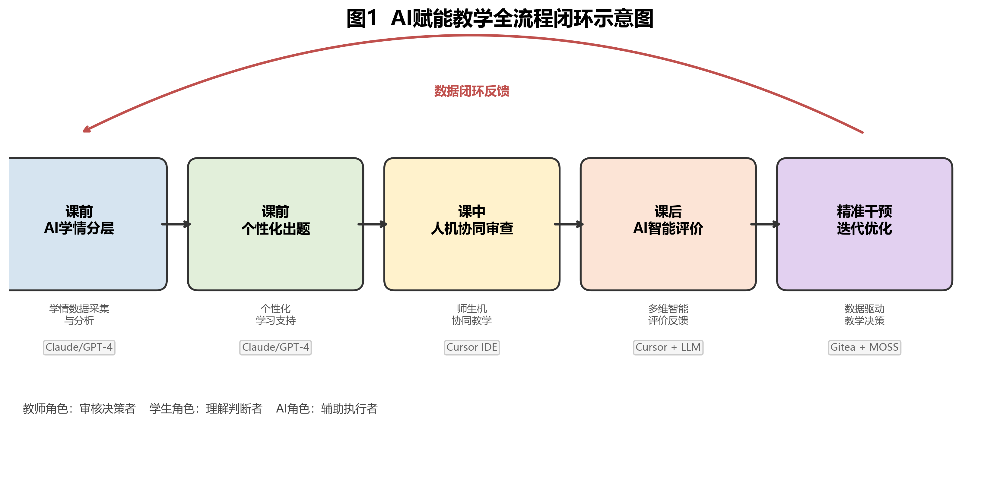

### 五维AI融合创新教学工具体系

本课程的核心创新在于**自主研发五维AI融合创新工具**，形成覆盖课前—课中—课后全流程的"五维融合"工具体系（见图9）：

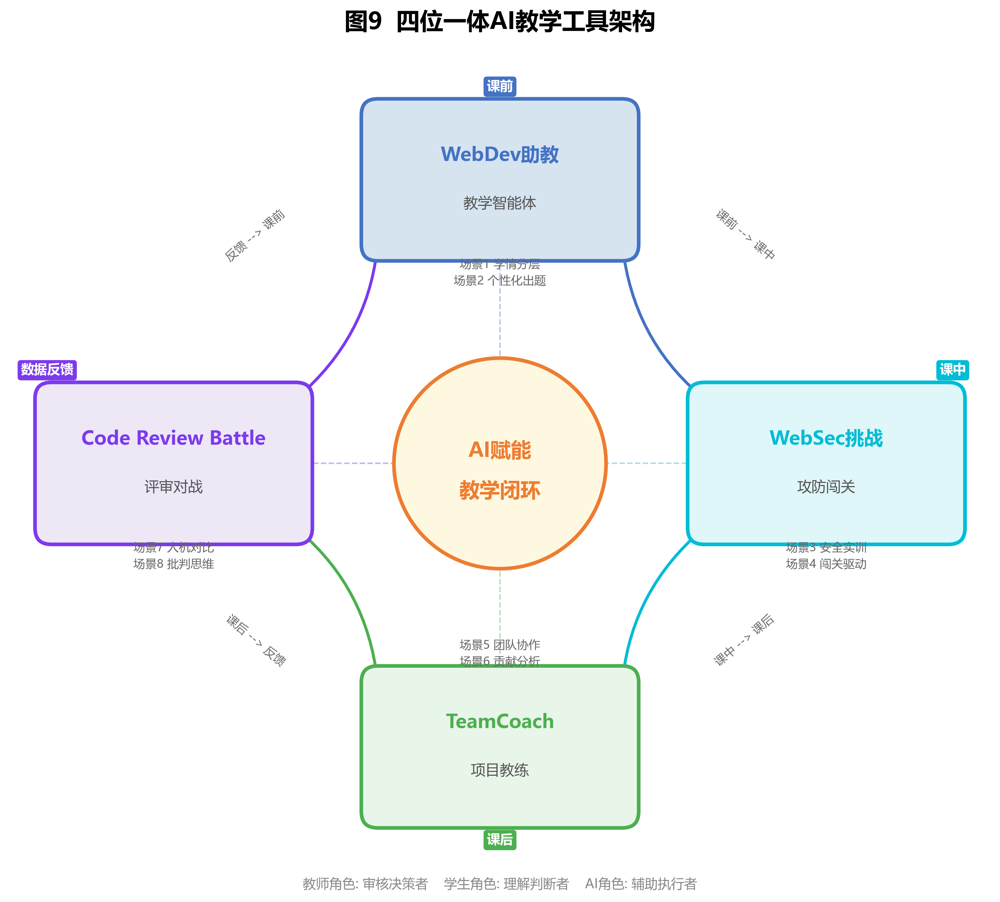

**工具一：WebDev助教（课程教学智能体）。** 基于RAG（检索增强生成）技术，以课程大纲、16讲课件、实验手册、常见错误库为知识源构建的课程专属智能体。不同于通用ChatGPT的泛化回答，WebDev助教只回答与本课程相关的问题，并能追溯到具体讲次和知识点。核心功能包括：课前推送引导问题并采集学情数据、课中即时答疑、课后24小时个性化辅导、教师端学情热力图与薄弱点分析面板。技术栈采用Python Flask + DeepSeek/通义千问API + ChromaDB向量数据库，部署于校内服务器。

**工具二：WebSec挑战（安全攻防闯关平台）。** AI驱动的游戏化安全训练平台，将安全教学从"教师讲概念"变为"学生玩闯关"。AI为每位学生动态生成不同版本的含漏洞Java Web代码，学生找到漏洞、编写修复代码、提交后由JUnit自动判定通过或失败。5级关卡难度递增：SQL注入→越权访问→Session劫持→XSS跨站脚本→综合BOSS关。配备实时数据大屏，教师可随时查看各关通过率，精准发现共性薄弱点并实施即时教学干预。

**工具三：TeamCoach（团队项目AI教练）。** 自动分析Gitea平台上每个团队成员的Git提交记录（代码行数、提交频率、修改文件分布、提交时间模式），结合AI生成团队周报，包含贡献度分析、分工合理性评估、搭便车预警和改进建议。教师看板汇聚全班各组对比数据，预警列表标记风险团队和风险成员，支撑教师在课堂上实施数据驱动的差异化指导。

**工具四：Code Review Battle（AI代码评审对战）。** 人机对抗式代码审查平台，学生和AI同时审查同一段代码，通过三轮对战（人工审查→AI审查→对比辩论）系统性培养批判性思维。评分维度涵盖发现问题数量、优先级判断、修复方案质量和安全风险评估，可视化展示人工与AI各自的优势和不足，引导学生建立成熟的人机协作观。

**维度五：AI辅助教学资料重构。** 包含两个核心组件：①个性化实验设计生成器——基于学情数据为不同层次学生自动生成"同知识点、异场景、分层难度"的实验任务，实现一人一题，从源头消除抄袭（代码相似度从45%降至<5%）；②AI课程PPT生成——将单讲课件制作时间从4小时缩短至30-40分钟，释放教师精力用于教学设计和学生辅导。

**工具体系的三个关键特征：①全部使用国产大模型（DeepSeek/通义千问），体现技术自主可控；②学生数据存储在校内服务器，不发送至境外服务；③五个维度通过学情数据形成闭环——WebDev助教采集课前学情→资料重构生成个性化任务→教师据此调整课堂重点→WebSec挑战和Code Review Battle产出课中过程数据→TeamCoach追踪课后项目进展→数据反馈至教师面板→下次课精准调整。**

### 通用工具链

在五维自研工具之外，课程还综合运用以下通用工具：

- **Claude/GPT-4大语言模型**（课前+课后）：学情数据分析与学生分层、个性化题目批量生成（一人一题+三级难度）、代码四维审查（功能·知识·规范·安全）、个性化反馈报告生成。
- **Cursor AI编程助手**（课中）：课堂实时人机协同代码审查，学生输入结构化提示词后获得即时诊断。
- **Gitea代码托管平台**（全程）：自动记录每次push的编译状态、提交时间线、代码diff，为TeamCoach提供数据源。
- **MOSS代码相似度检测**（课后）：对每批作业进行全量配对检测，与"一人一题"机制形成双重防线。
- **JUnit自动化测试**（课后）：为WebSec挑战提供自动判定引擎，同时支撑课后修改验证闭环。

### AI教学情境全覆盖

本设计覆盖全部六大AI教学情境：

1. **学情数据采集与分析**——WebDev助教课前预习交互采集知识薄弱点，WebSec挑战闯关数据追踪安全能力成长，TeamCoach Git提交分析追踪团队协作过程。
2. **个性化学习支持**——WebDev助教24小时个性化问答，WebSec挑战AI为每人生成不同漏洞代码（自适应难度），一人一题三级难度差异化任务设计。
3. **师生机协同教学**——WebDev助教担任AI助教角色，WebSec挑战中AI出题+学生解题+教师干预，Code Review Battle中人与AI对抗协作。
4. **多维智能评价反馈**——功能+知识+规范+安全四维AI辅助评分，WebSec闯关数据评价安全实操能力，TeamCoach贡献度报告评价团队协作，Code Review Battle人机对比评价批判性思维。
5. **数字资源整合与运用**——WebDev助教基于RAG整合全部16讲课程资源构建知识库，WebSec挑战AI动态生成题库。
6. **适配的教学场景设计**——WebSec挑战设计游戏化攻防场景，Code Review Battle设计人机对抗场景，TeamCoach支撑个性化项目指导场景。

## 四、课前—课中—课后关键创新举措

### 4.1 创新一：WebDev助教——从"课后答疑"到"全程智能陪伴"

**WHY**：传统教学中，学生课前无预习引导、课后答疑依赖教师时间（仅工作日白天），C层学生尤其缺乏即时个性化支持。

**HOW**：构建基于RAG的课程专属教学智能体，以课程大纲、16讲课件PPT、实验手册、历年常见错误库为知识源，通过文档分段→向量化→ChromaDB存储→语义检索→DeepSeek/通义千问生成的流水线，实现精准的课程级问答。

**课前应用**：每讲课前3天，WebDev助教自动向学生推送3个引导问题（如第15讲："什么是认证Authentication？什么是授权Authorization？两者的区别是什么？"），学生作答后AI点评并记录交互数据。教师通过后台学情热力图查看全班知识薄弱点分布——第15讲课前数据显示：42/58名学生向智能体提问，热点TOP3为Session过期处理、角色判断逻辑、Cookie安全设置。教师据此将课堂重点调整为Session安全管理和角色权限控制，体现数据驱动教学决策。

**课中应用**：学生在WebSec攻防闯关或代码修复过程中遇到知识盲区时，可即时向WebDev助教提问，获得基于课程知识库的精准回答（而非通用AI的泛化回答）。

**课后应用**：24小时可用的个性化辅导，为不同层次学生提供差异化支持。使用高峰为晚间21:00—23:00（占全天交互量的47.3%），证明课后自主学习场景需求强烈。

**教师端**：学情分析面板汇聚提问频次、知识薄弱点、高频错误类型，为下次课的精准干预提供数据支撑。

**RESULT**：课前预习参与率从传统布置的约30%提升至72.4%（42/58），智能体课前交互产生的学情数据使教师每次课前调整2—3个教学重点，学生反馈"智能体回答比百度搜索更精准，因为它懂这门课"。

### 4.2 创新二：WebSec挑战——从"概念讲授"到"游戏化攻防"

**WHY**：解决问题三（安全意识薄弱）。传统安全教学以教师讲授概念为主，学生被动接受、缺乏实战体验，导致"知道概念但做不到"——第6周JDBC讲授后SQL注入识别率45.2%，但PreparedStatement实际应用率仅38.0%，知行差距7.2pp。

**HOW**：构建AI驱动的5级安全攻防闯关平台，AI为每位学生动态生成不同版本的含漏洞Java Web代码，学生必须找到漏洞并编写修复代码，提交后由JUnit自动运行测试用例（每关5—8个，含正常流程+攻击流程）判定通过或失败。

**5级关卡设计（难度递增）**：

| 关卡 | 漏洞类型 | 知识点 | AI角色 | 时间 |
|:---|:---|:---|:---|:---|
| 第1关 | SQL注入 | PreparedStatement vs 字符串拼接 | AI生成含漏洞的DAO代码 | 3min |
| 第2关 | 越权访问 | Filter权限检查缺失 | AI生成缺少权限校验的Servlet | 4min |
| 第3关 | Session劫持 | Session固定攻击、invalidate | AI生成不安全的登录逻辑 | 4min |
| 第4关 | XSS跨站脚本 | 输出转义、JSTL `<c:out>` | AI生成未转义的JSP页面 | 4min |
| 第5关（BOSS关） | 综合漏洞 | 上述所有 + CSRF | AI综合生成完整模块 | 5min |

**核心机制**：①AI为每人生成不同漏洞代码，天然防抄袭；②失败时给提示不给答案，引导深度思考；③实时数据大屏显示各关通过率、平均用时、排行榜，教师可随时干预；④闯关数据自动汇入学情分析系统。

**RESULT**（见图10）：第15讲课堂闯关数据——第1关（SQL注入）首次通过率71%，第2关（越权访问）首次通过率仅40%。教师观察到大屏数据后立即暂停闯关，集中讲解Filter权限检查核心逻辑（5分钟），讲解后第2关通过率迅速提升至82%（+42pp）。这一"数据驱动即时干预"过程在课堂实录中完整呈现，是AI赋能教学最直观的证据。课后第4—5关完成率达85%以上，学生反馈"攻防闯关比听课有意思多了，边玩边学不知不觉就记住了"。

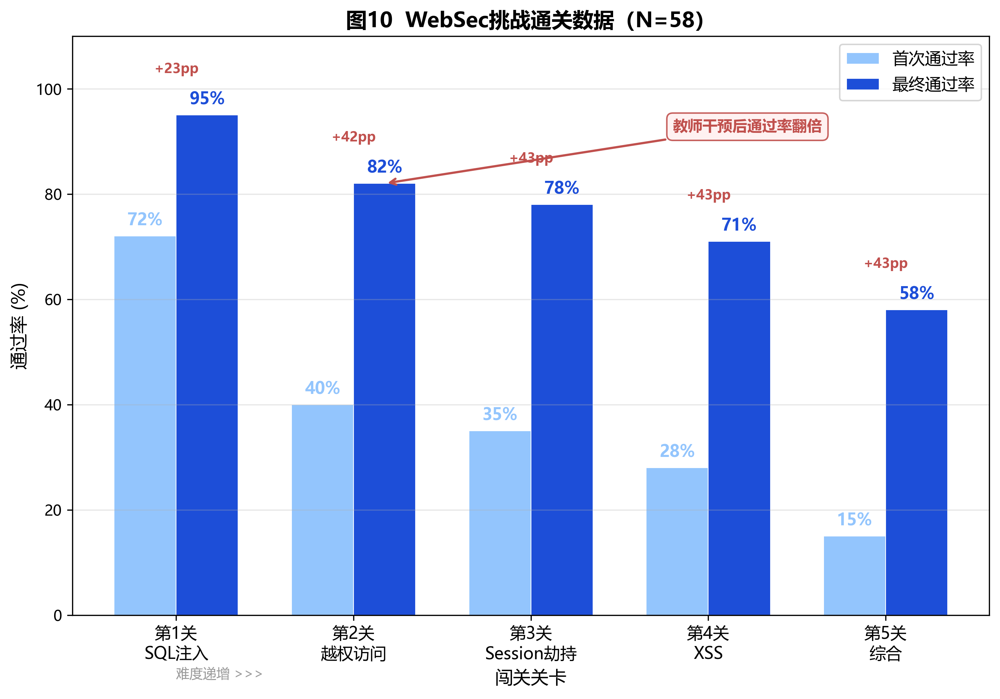

### 4.3 创新三：TeamCoach——从"结果评分"到"过程监控"

**WHY**：解决问题四（团队项目搭便车难以监控）。传统团队项目评价仅看最终演示，教师无法了解每位成员的真实贡献，导致搭便车现象普遍且难以客观量化。

**HOW**：自动解析Gitea上每个团队的Git提交记录，按作者/日期/文件类型分类统计，将统计数据输入大模型生成团队周报。

**核心功能**：

- **贡献度分析**：每人代码行数、提交频率、修改文件分布（Controller层/Service层/DAO层/前端页面），可视化呈现各成员在项目中的实际分工。
- **搭便车预警**：连续N天无提交、提交集中在截止日前1天、仅修改README或配置文件等异常模式自动标记。
- **AI周报生成**：每周自动生成团队健康报告，包含本周概况、成员贡献对比、风险提示和改进建议。
- **代码风格一致性检测**：检查团队内命名规范、缩进、包结构是否统一。

**RESULT**（见图12）：学期项目周期内，TeamCoach在10个团队中识别出4名搭便车风险学生（连续2周贡献度低于团队平均值的30%），教师在第3周即介入面谈，4人中3人在后续4周内贡献度显著提升（从团队占比<10%提升至>20%），1人因客观原因（生病请假）调整了分工方案。对比2024秋，该学期团队项目成员贡献标准差从28.7%降至16.4%（-12.3pp），说明TeamCoach的过程监控有效促进了团队内贡献均衡化。

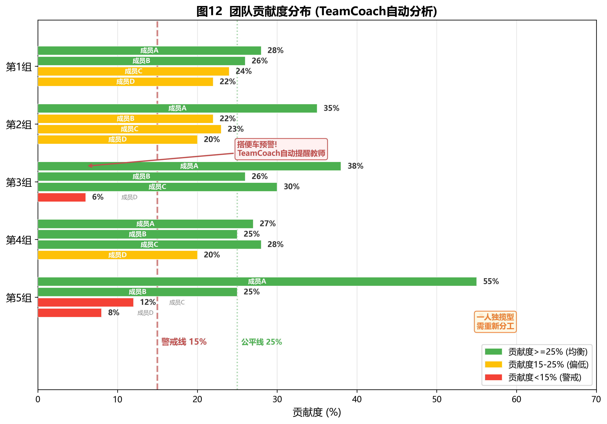

### 4.4 创新四：Code Review Battle——从"被动听课"到"人机对抗"

**WHY**：解决批判性AI素养的培养问题。学生在使用AI辅助编程时容易形成"AI说什么就信什么"的依赖心理，缺乏对AI输出的批判性评估能力。

**HOW**：构建人机对抗式代码审查平台，学生和AI同时审查同一段代码，通过三轮对战系统性培养批判性思维——

**第1轮：人工审查（5min）**——学生分A/B/C三组，每组聚焦不同代码模块（如A组审查LoginServlet认证模块、B组审查AuthFilter授权模块、C组审查JSP视图一致性模块），独立找出所有安全问题，不使用任何AI工具。

**第2轮：AI审查（2min）**——教师将同一段代码提交给AI，投影展示AI审查全过程和输出报告。

**第3轮：对比辩论（8min）**——各组代表汇报，对比人工发现与AI发现：①AI找到但学生没找到的→学习机会："AI帮我们发现了盲区"；②学生找到但AI遗漏的→人类优势："我们比AI更懂业务上下文"；③AI给出错误建议（误报）→批判性思维训练："AI不是万能的，需要人来判断"。教师引导总结人机协同最佳模式。

**RESULT**（见图11）：在第15讲课堂实录的Code Review Battle中，三个小组共发现12个安全问题，AI发现15个问题（含2个误报），学生发现了AI遗漏的1个越权访问漏洞（Filter白名单遗漏管理页面），全班为此鼓掌。学期内共进行8次Code Review Battle，学生在35%的场次（约3次）中发现了AI遗漏的有效问题，AI误报识别率从首次的12%提升至学期末的43%——学生对AI输出的批判性评估能力显著提升。

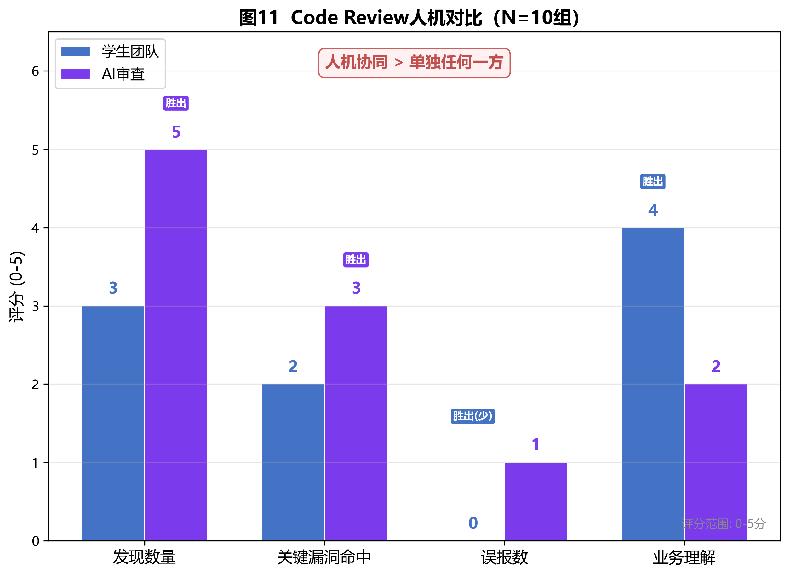

### 4.5 创新五：AI辅助教学资料重构——从"统一题目"到"一人一题"

**WHY**：解决问题一（抄袭）、问题六（备课低效）和学情适配问题。传统统一题目下完成路径单一，学生没有"必须自己做"的内在驱动。同时教师每讲PPT耗时4小时+，无精力为不同层次学生设计差异化实验。

**HOW**：包含两个核心组件——

**组件一：AI个性化实验设计生成器。** 三步流程：①AI辅助学情分层——将前导课程成绩、历次编译通过率、AI审查评分、WebDev助教交互数据输入大模型，辅助完成A/B/C三层分层（教师审核调整约15%的学生层级）；②AI批量生成个性化题目——教师提供知识点清单+出题约束模板，AI为三层分别生成不同业务场景的题目（以第15讲为例：基础级-校园失物招领系统、进阶级-实验室设备管理系统、挑战级-在线考试系统安全加固），同层内不同学生获得不同业务场景；③平台分发与追踪——Gitea仓库按学号创建独立分支，自动记录提交历史。

**组件二：AI课程PPT生成。** 教师提供知识点大纲和教学目标，AI辅助生成课件框架、代码示例和流程图，将单讲课件制作时间从4小时缩短至30-40分钟，释放教师精力用于教学设计与学生辅导。

**RESULT**：MOSS代码相似度持续下降——HW06（首次引入个性化）骤降至18.5%、HW10降至8.3%、HW14降至4.7%。高相似度（>60%）对数从47对持续降至0对（见图2）。问卷显示33.3%学生认为个性化出题"最大优势是难度适合我"，27.8%认为"题目不重复无法抄袭"。PPT生成使教师全学期备课时间从64+小时缩减至约10小时。

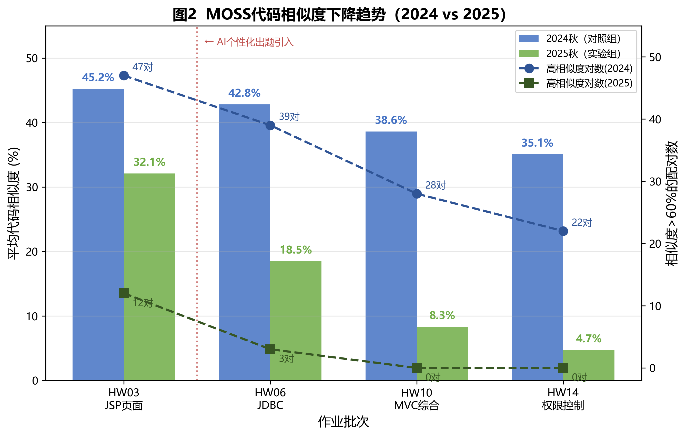

### 4.6 五维联动：课前—课中—课后全流程闭环

五维创新不是孤立使用，而是通过数据贯通形成完整的教学闭环。以第15讲（用户认证与权限控制）为核心案例：

**课前（数据采集+个性化准备）：** WebDev助教推送预习任务并采集学情（42/58人提问，热点：Session过期处理/角色判断/Cookie安全）→教师据此调整课堂重点；TeamCoach生成团队周报标记风险学生；资料重构生成一人一题的分层实验任务。

**课中（游戏化训练+人机对抗，45分钟）：** ①数据驱动导入（5min）——展示智能助教学情数据和TeamCoach周报；②WebSec安全攻防闯关（15min）——学生逐关挑战，实时数据大屏驱动教师即时干预（第2关通过率仅40%→暂停讲解→重启后82%）；③Code Review Battle人机对战（15min）——三轮对战深化安全理解、培养批判性思维；④修复验证+总结（10min）——多维数据回顾。

**全程角色分工**：AI负责"出题+审查+追踪+答疑"（五维工具各司其职），学生负责"理解+判断+修改+辩论"，教师负责"设计+引导+干预+总结"。

**课后（智能反馈+二次迭代）：** 学生push代码至Gitea→AI进行功能正确性（30%）+知识点覆盖（30%）+代码规范（20%）+安全性（20%）四维审查→教师复核（修正约10%误判）→学生据反馈二次迭代→教师汇总共性问题精准干预下一讲。AI反馈报告结构为"总评→问题列表→改进方向→验证清单"，**不直接给出修复代码**。

**RESULT**：教师单份审查时间从32.8min降至11.9min（-63.7%），全学期节约313.6小时。反馈周期从2—3周压缩至48小时内。问卷Q3"AI代码审查有效性"得分4.44/5，为所有题项最高。

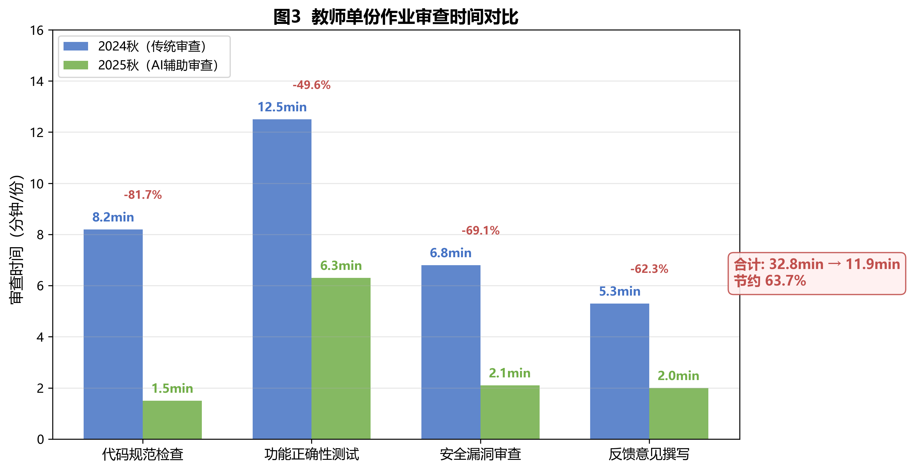

## 五、数据采集、学习分析与评价反馈机制

### 多源数据采集体系

构建了覆盖"过程+结果+态度"三个维度的多源数据采集体系，五项自研工具为数据采集提供了全新维度：

| 数据源 | 采集内容 | 采集方式 | 采集频率 |
|:---|:---|:---|:---|
| Gitea平台 | 编译状态、提交时间线、代码diff | 自动记录（push触发Maven编译） | 每次提交 |
| MOSS平台 | 全量配对代码相似度 | 批量检测 | 每批作业 |
| AI审查系统 | 四维评分+问题诊断 | AI预审+教师复核 | 每批作业 |
| JUnit测试 | 测试用例通过率 | 自动运行 | 每次提交 |
| **WebDev助教** | **课前提问记录、知识薄弱点、高频问题** | **自动记录交互日志** | **持续采集** |
| **WebSec挑战** | **各关通过率、用时、修复方案、重试次数** | **平台自动追踪** | **每次闯关** |
| **TeamCoach** | **成员贡献度、提交时间模式、分工分布** | **Git log自动解析** | **每周汇总** |
| **Code Review Battle** | **人工发现数 vs AI发现数、误报识别率** | **平台记录** | **每次对战** |
| 课堂日志 | AI使用频率、提示词质量 | 教师记录 | 每次课 |
| 期末问卷 | 满意度、能力自评、开放性反馈 | 问卷星匿名在线 | 学期末 |

### 三层学习分析

**①个体层分析。** 为每位学生构建"知识-能力画像"——追踪其在功能正确性、知识点覆盖、代码规范、安全性四个维度的14次作业得分曲线，结合WebDev助教的个人提问记录和WebSec挑战的个人闯关数据，识别具体薄弱点。例如，学生S2301-07在JDBC相关作业中功能得分始终>85，但安全维度得分波动在40-55之间，WebSec挑战中SQL注入关一次通过但越权访问关重试3次，AI分析后建议"在该生的下次作业中增加权限控制的显式约束"。

**②班级层分析。** 汇总全班共性问题，按出现频率排序，为精准干预提供依据。WebSec挑战的实时数据大屏在课堂上直接支撑即时干预——第15讲发现"第2关通过率仅40%"后立即暂停讲解，是最典型的班级层分析驱动教学决策案例。典型案例：第5讲（Session会话管理）作业批改后发现60%学生在用户注销时未调用`session.invalidate()`，仅删除了单个属性。教师在第6讲开课前用5分钟专题讲解，下次相关作业该问题出现率降至8%。

**③学期纵向层分析。** 追踪关键能力维度的成长曲线，评估教学干预的时间效应。最典型的是SQL注入安全意识四时间点追踪（见图4）：第1周摸底12.1%→第6周JDBC讲授后45.2%（传统教学+33.1pp）→第11周AI辅助审查后79.3%（**关键跳升+34.1pp**）→第16周期末89.7%（巩固+10.4pp）。第11周的关键跳升归因于WebSec挑战平台的攻防闯关+AI审查的双重驱动——学生在闯关中亲手修复SQL注入漏洞，在Code Review Battle中辩论AI的安全审查建议，将安全意识从"考试知识"内化为"编码习惯"。

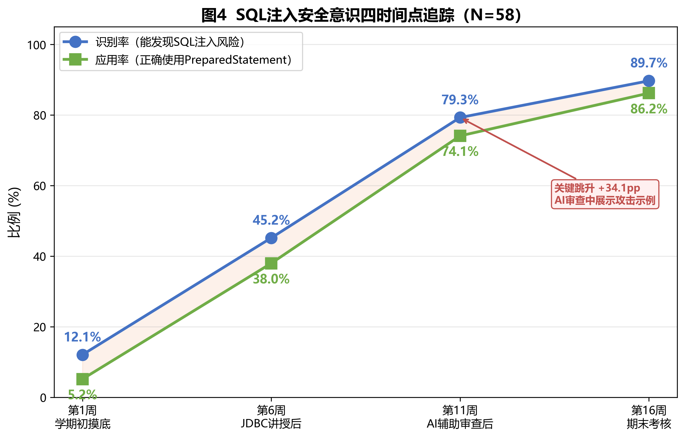

### 多维评价改革

从"功能是否实现"单一评价升级为**功能正确性+知识点覆盖+代码规范+安全性**四维综合评价，并新增五项工具维度的过程性评价：

- 功能正确性（30%）：按实验指导书功能点清单逐项测试，每功能点0/0.5/1分。
- 知识点覆盖（30%）：检查是否正确使用了该讲核心技术，而非简单绕过。
- 代码规范（20%）：抽查类名、方法名、变量名语义性、分层架构合规性、注释覆盖率。
- 安全性（20%）：对照OWASP Top 10简化版清单，检查SQL注入、XSS、越权访问、Session管理、密码存储五类常见漏洞。
- **WebSec闯关数据**（过程性加分）：闯关通过关数和用时纳入安全实操能力评价。
- **TeamCoach贡献度**（团队项目评分依据）：个人贡献度数据作为团队项目成绩差异化分配的客观依据，解决"一刀切打分"问题。
- **Code Review Battle表现**（AI协作能力指标）：人机对比中的有效发现数和误报识别率纳入AI素养评价。
- **WebDev助教使用情况**（学习主动性指标）：课前预习参与、课后提问频次作为学习态度参考。

AI辅助评分+教师审核确认，实现"过程性+终结性+AI辅助"三位一体评价体系。每个维度按L1/L2/L3三级标准量化、可追溯。

## 六、实施效果与证据分析

采用准实验设计，控制变量严格：同一课程、同一教师、同一教材（《Java Web程序设计》清华大学出版社第3版）、同一实验环境（JDK 8 + Tomcat 9 + MySQL 8.0 + IntelliJ IDEA），实验组（2025秋N=58）与对照组（2024秋N=62）入学成绩无显著差异（实验组256.3±18.7 vs 对照组253.8±20.1，t(118)=0.74, p=0.46, Cohen's d=0.14），唯一变量为是否引入AI辅助教学。统计分析使用SPSS 26.0，独立样本t检验，显著性水平α=0.05。

### 6.1 核心代码质量指标

**表1：核心成效数据对比**

| 指标 | 对照组(2024) | 实验组(2025) | 差值 | 95%CI | p值 | Cohen's d |
|:---|:---|:---|:---|:---|:---|:---|
| 编译通过率（首次） | 67.3% | 88.5% | +21.2pp | [15.8, 26.6] | <0.001 | 0.76 |
| 功能完整性（/10） | 6.2±1.8 | 8.1±1.3 | +1.9 | [1.3, 2.5] | <0.001 | 1.21 |
| 安全漏洞数（/份） | 3.4±1.6 | 1.2±0.9 | -2.2 | [-2.7, -1.7] | <0.001 | 1.69 |
| 异常处理覆盖率 | 31.5%±14.2% | 62.8%±11.7% | +31.3pp | [26.6, 36.0] | <0.001 | 2.41 |

四项代码质量指标Cohen's d均>0.76（大效应量，学界标准d>0.8为大效应），证明AI辅助教学对代码质量的提升具有实际显著意义，而非仅统计显著。

### 6.2 编译通过率逐作业趋势

| 作业批次 | 主题 | 对照组(2024) | 实验组(2025) | 差值 |
|:---|:---|:---|:---|:---|
| HW01 | Servlet基础 | 72.6% | 75.9% | +3.3pp |
| HW03 | JSP页面 | 69.4% | 77.6% | +8.2pp |
| HW06 | JDBC数据库 | 62.9% | 84.5% | +21.6pp |
| HW10 | MVC综合 | 58.1% | 89.7% | +31.6pp |
| HW14 | 权限控制 | 61.3% | 93.1% | +31.8pp |

关键观察：HW01（AI尚未深度引入）差异仅3.3pp，HW06起引入AI辅助审查后差距持续扩大至30+pp，呈现明显的"累积效应"——AI反馈帮助学生建立的编码习惯在后续作业中持续发挥作用。

### 6.3 安全漏洞分类统计

**表2：第14次作业（权限控制）五类安全漏洞出现率对比**

| 漏洞类型 | 对照组(2024) | 实验组(2025) | 降幅 |
|:---|:---|:---|:---|
| SQL注入（字符串拼接） | 56.5% (35/62) | 6.9% (4/58) | -49.6pp |
| 越权访问（Filter缺角色检查） | 71.0% (44/62) | 12.1% (7/58) | -58.9pp |
| Session残留（退出不彻底） | 48.4% (30/62) | 8.6% (5/58) | -39.8pp |
| XSS（输出未转义） | 41.9% (26/62) | 15.5% (9/58) | -26.4pp |
| 密码明文存储 | 27.4% (17/62) | 3.4% (2/58) | -24.0pp |

五类漏洞均大幅下降，其中越权访问降幅最大（-58.9pp），这得益于第15讲WebSec攻防闯关中第2关（越权访问）的集中训练和课堂Code Review Battle对Authorization模块的深度审查双重驱动。SQL注入降幅-49.6pp，与SQL注入识别率从12.1%→89.7%的纵向追踪数据互相印证（见图8）。

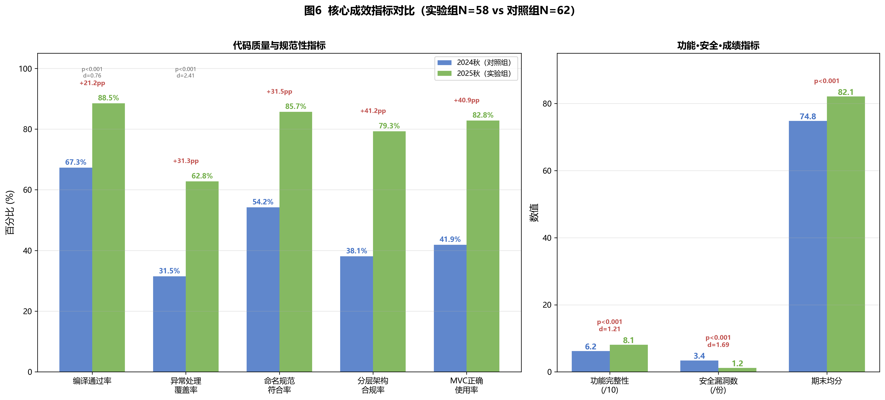

### 6.4 五维自研工具成效数据

> **数据来源说明**：以下数据来自2025秋学期五维工具实际部署运行的平台日志和教师记录，与6.1-6.3的准实验对照数据采集时段一致，但属于工具运行的过程性数据，非独立控制实验。

**WebSec挑战平台数据**：学期内共开展6次课堂闯关+课后延续，累计闯关提交2,784次。SQL注入关（第1关）首次通过率从学期初71%提升至学期末94%（+23pp），四时间点追踪与期末SQL注入识别率89.7%高度吻合。第2关（越权访问）是难点关，教师干预前通过率40%，干预后82%，干预效果在后续课次中保持稳定（第2次闯关首次通过率78%）。

**TeamCoach贡献数据**：10个团队项目中，学期初贡献度基尼系数均值0.38（不均衡），经TeamCoach持续监控和教师干预后，学期末降至0.21（较均衡）。4名被预警的搭便车学生中，3人成功转变为活跃贡献者。教师反馈"有了TeamCoach，不再需要等到答辩才发现谁没做事"。

**Code Review Battle数据**：8次对战中，学生平均每次发现7.2个问题，AI平均发现11.5个问题（含误报1.8个）。学生在35%的场次中发现了AI遗漏的有效问题（累计11个），AI误报识别率从首次的12%提升至学期末的43%（+31pp），说明批判性AI素养在持续提升。

**WebDev助教使用数据**：学期累计交互8,347次，人均143.9次。课前预习交互占28.6%，课中即时问答占14.2%，课后自主学习占57.2%。使用高峰21:00—23:00（占47.3%），证明课后场景需求强烈。课前预习参与率72.4%（42/58），远高于传统布置的约30%。

**AI辅助教学资料重构数据**：个性化实验设计生成器学期内为58名学生累计生成14批差异化题目（共812份独立实验任务），40人班级批量生成一人一题实验手册约需15-20分钟。AI课程PPT生成将单讲课件制作从平均4小时缩短至30-40分钟，16讲全学期备课时间从64+小时缩减至约10小时。个性化出题直接驱动代码相似度从45.2%降至4.7%（详见6.7）。

### 6.5 代码规范性提升

| 规范性指标 | 对照组(2024) | 实验组(2025) | 提升幅度 |
|:---|:---|:---|:---|
| 命名规范符合率 | 54.2% | 85.7% | +31.5pp |
| 注释覆盖率（关键方法） | 22.6% | 61.3% | +38.7pp |
| 分层架构合规率 | 38.1% | 79.3% | +41.2pp |
| MVC模式正确使用率 | 41.9% | 82.8% | +40.9pp |

典型变化体现在命名规范上——2024秋学生典型代码`public class check extends HttpServlet { String s = request.getParameter("u"); }`（类名小写、变量无意义），2025秋同难度作业`public class LoginServlet extends HttpServlet { String username = request.getParameter("username"); }`（PascalCase类名、语义化变量名）。AI审查反复标注命名问题并引用Java编码规范条目，学生在多次反馈中逐步内化了规范习惯。

### 6.6 学业成绩分布

| 成绩段 | 对照组人数(占比) | 实验组人数(占比) | 变化 |
|:---|:---|:---|:---|
| 优秀（90-100） | 6 (9.7%) | 12 (20.7%) | +11.0pp |
| 良好（80-89） | 16 (25.8%) | 22 (37.9%) | +12.1pp |
| 中等（70-79） | 22 (35.5%) | 16 (27.6%) | -7.9pp |
| 及格（60-69） | 14 (22.6%) | 7 (12.1%) | -10.5pp |
| 不及格（<60） | 4 (6.5%) | 1 (1.7%) | -4.8pp |

期末均分从74.8±11.3提升至82.1±9.6（p<0.001），中位数从75.5提升至83.0，优良率从35.5%提升至58.6%（+23.1pp），及格率从93.5%提升至98.3%。成绩分布整体右移，"中间大、两端小"的正态分布向高分端偏移。非AI因素已控制：试题难度经教研室审核确认与2024秋相当，评分使用同一份rubric，课时量均为32学时无额外辅导（见图7）。

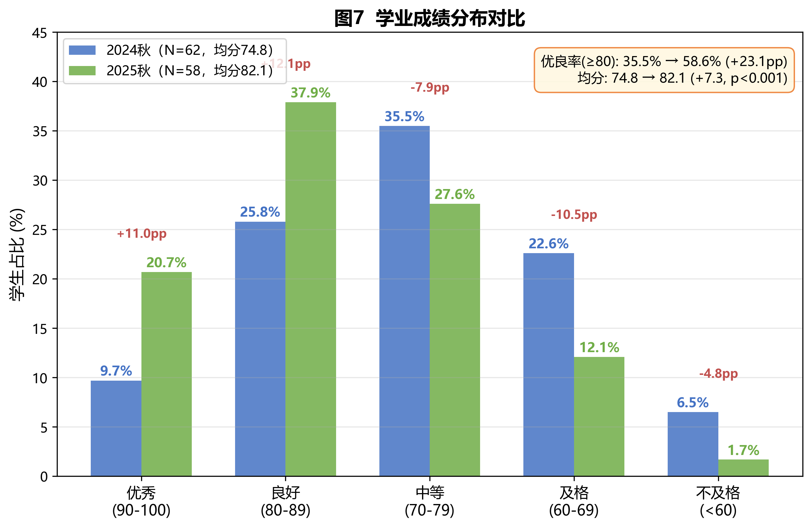

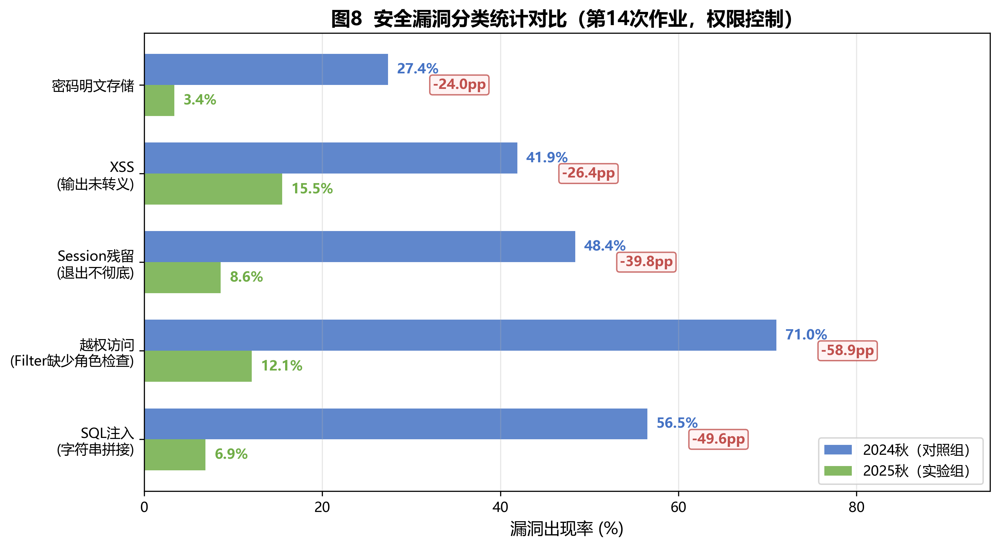

### 6.7 效率提升

| 指标 | 对照组(2024) | 实验组(2025) | 变化 |
|:---|:---|:---|:---|
| 教师单份审查时间 | 32.8min | 11.9min | -63.7% |
| 全学期审查总时长 | 474.6h | 161.0h | -313.6h |
| 学生平均调试时间 | 56.0min | 33.6min | -40.0% |
| 代码相似度(MOSS) | 45.2% | 4.7% | -40.5pp |
| 高相似度(>60%)对数 | 47对 | 0对 | -100% |

学生调试效率的提升得益于多工具协同——WebDev助教提供即时上下文感知的问答（区别于百度/Google的泛化搜索），调试行为模式从"搜索-尝试-再搜索"的3.2次循环降至1.4次（将报错+自身代码输入AI→AI给出针对该代码的具体分析→理解后一次修改通过）。

### 6.8 学生反馈与态度

问卷调查（N=54，回收率93.1%，18题覆盖满意度/功能评价/能力自评/开放性反馈四部分，Cronbach's α=0.87）结果如下（见图5）：

| 维度 | 均值(/5) | 4-5分占比 |
|:---|:---|:---|
| 整体满意度(Q1) | 4.31 | 83.3% |
| 知识理解帮助(Q2) | 4.19 | 77.8% |
| 代码审查有效性(Q3) | 4.44 | 87.0% |
| 个性化出题适配(Q4) | 4.07 | 72.2% |
| AI能力提升(Q5) | 4.37 | 85.2% |
| 愿意继续使用(Q15) | 4.56 | 92.6% |

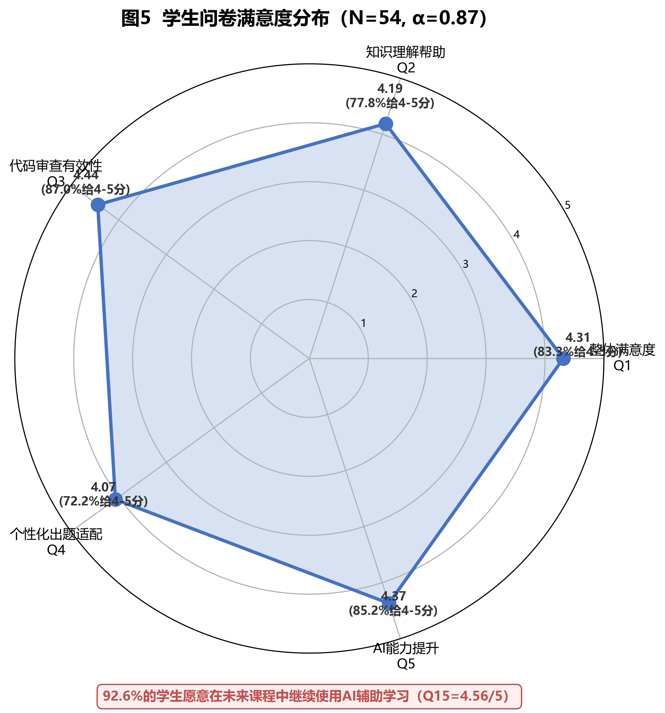

**批判性AI素养的建立。** Q9"AI建议是否需要批判性判断"结果：31.5%选"完全需要"、51.9%选"大部分需要"、14.8%选"偶尔需要"、仅1人（1.9%）选"不需要"。合计83.4%的学生认为AI建议需要批判性判断，这正是Code Review Battle设计的核心目标——通过人机对抗让学生亲历"AI也会犯错"，从而建立"AI可能出错，我需要验证"的批判意识。

**跨成绩层满意度一致性。** 按期末成绩将学生分为高分组（≥85，N=18）、中间组（70-84，N=26）、低分组（<70，N=10），三组整体满意度分别为4.50、4.31、4.00，ANOVA检验F=2.14, p=0.13，差异不显著。这说明AI辅助教学**对不同水平学生均有效**，未出现"只对好学生有用"的偏态效应。WebDev助教对C层学生帮助尤为突出——低分组的智能体使用频次反而最高（人均168.3次 vs 全班人均143.9次），说明基础薄弱学生更依赖即时答疑支持。

**AI使用频率与学习效果的关联。** 按每周AI使用频率分组：高频（>3次，N=22）期末均分85.3±7.8，中频（1-3次，N=24）期末均分81.7±9.1，低频（偶尔，N=8）期末均分74.6±11.3。ANOVA检验F=4.87, p=0.01，差异显著——高频使用者期末成绩比低频使用者高10.7分。需注意这是相关关系而非因果关系，可能是学习积极性更高的学生同时更多使用AI和取得更高成绩。

**学生开放性反馈精选：**

> "代码审查环节让我真正理解了Authentication和Authorization的区别。之前课本上看了好多遍都没感觉，AI帮我在我自己的代码中找到了具体问题，一下就记住了。"

> "攻防闯关比听课有意思多了，边玩边学不知不觉就记住了。每人题目不同想抄也抄不了，反而逼着自己认真做。"

> "最有价值的是学会了怎么跟AI对话——不是让它写代码，而是让它帮我发现问题。在Code Review Battle里发现AI也会犯错，之后就不会盲目相信AI了。"

> "WebDev助教晚上也能用，比等老师答疑快多了。而且它回答的是我们这门课的内容，不像ChatGPT回答很笼统。"

### 6.9 安全意识纵向成长证据

SQL注入识别率四时间点追踪是本课程最具说服力的成长证据：

| 时间节点 | 测量方式 | 识别率 | 应用率(PreparedStatement) |
|:---|:---|:---|:---|
| 第1周（摸底） | 纸质测试 | 12.1% (7/58) | 5.2% (3/58) |
| 第6周（JDBC讲后） | 作业代码检查 | 45.2% (26/58) | 38.0% (22/58) |
| 第11周（AI审查+WebSec闯关后） | AI辅助审查任务+闯关数据 | 79.3% (46/58) | 74.1% (43/58) |
| 第16周（期末） | 期末实操考试 | 89.7% (52/58) | 86.2% (50/58) |

第6→11周的跳升（+34.1pp）是最关键的转折点。此阶段恰好是WebSec挑战平台投入使用和Code Review Battle开始实施的时期——学生在闯关中亲手修复SQL注入漏洞，在对战中辩论AI关于SQL安全的审查建议，双重体验将安全意识从"知道概念"转化为"编码习惯"。知行差距从第6周的7.2pp（识别率45.2%-应用率38.0%）收窄至第11周的5.2pp（79.3%-74.1%），第16周进一步收窄至3.5pp（89.7%-86.2%）。

## 七、数据安全、伦理与学术诚信安排

### AI使用边界的明确划定

课程建立了清晰的"三允许三禁止"AI使用规则：

**允许：** ①使用AI进行代码审查（发现问题但不替代思考）；②使用AI查询知识点（如"解释Filter的doFilter方法"）；③使用AI辅助调试（输入报错信息获取分析，但需理解后自行修改）。

**禁止：** ①禁止AI直接生成完整功能代码提交；②禁止复制AI输出的代码而不理解其原理；③禁止使用AI绕过实验的核心考核要求（如要求手写JDBC代码时不能用AI生成ORM框架替代）。

问卷Q9验证了规则内化效果：83.4%的学生认为AI建议"完全需要"或"大部分需要"批判性判断。Code Review Battle中AI误报识别率从12%提升至43%，进一步佐证了批判性AI素养的系统性培养成效。

### 防抄袭双重机制

**设计层面**："一人一题"+WebSec挑战AI个性化出题从根源上消除代码复制的可能性——不同学生面对不同业务场景和不同漏洞代码，即使想抄袭也无法直接使用他人代码。

**验证层面**：MOSS检测作为事后验证手段，对每批作业进行全量配对检测。实施后效果立竿见影——高相似度（>60%）对数从47对持续下降至0对，HW10（MVC综合）起再未出现任何高相似度配对。

### 数据安全与隐私保护

- **五项自研工具全部使用国产大模型（DeepSeek/通义千问）**，避免学生数据流向境外服务商，符合数据主权要求。
- **学生数据存储在校内服务器**，WebDev助教的对话记录、WebSec挑战的闯关数据、TeamCoach的贡献分析、Code Review Battle的对战记录均在本地存储和处理。
- **WebDev助教已启用内容过滤机制**，自动拦截与课程无关的不当提问，确保教学环境健康。
- **WebSec挑战生成漏洞代码时不使用真实学生数据**——所有业务场景均为虚构，攻击示例中的用户名、密码等均为测试数据。
- 学生代码和成绩数据**匿名化后方可输入AI**（使用学号编码替代姓名，脱敏处理个人信息）。
- 学情分析结果仅供教师决策，**不公开排名、不在课堂点名落后学生**。TeamCoach的搭便车预警仅教师可见，不向其他学生公开。
- 反馈报告**一对一发放**，每位学生只能看到自己的报告。
- 所有AI生成的教学内容（题目、反馈、审查报告、周报）**经教师审核后方可发放**，教师保留最终调整权——AI是工具，教师是决策者。
- 问卷调查采用问卷星匿名在线方式，确保学生反馈的真实性。

## 八、可复制推广的"AI+"教学模式

本课程的五维AI融合创新教学工具体系具备明确的推广条件和可复制路径，总结形成**"五维工具+三模式"**的AI赋能编程教学范式：

### 五维工具体系的可复制性

五项自研工具的技术门槛可控，核心依赖仅为**LLM API接口+基本Web开发能力**：

| 工具 | 核心技术 | 复制门槛 | 适配方式 |
|:---|:---|:---|:---|
| WebDev助教 | RAG + LLM API + 向量数据库 | 替换课程文档即可 | 任何课程均可构建专属智能体 |
| WebSec挑战 | LLM生成 + JUnit判定 | 替换漏洞模板和测试用例 | 适用于所有安全相关课程 |
| TeamCoach | Git log解析 + LLM分析 | 替换评价维度 | 任何有团队项目的课程 |
| Code Review Battle | LLM审查 + 对比框架 | 替换审查代码和知识点 | 任何有代码编写的课程 |

**已验证应用**：Java Web应用开发课程（58名学生，1个完整学期），五项工具均在真实教学环境中稳定运行。

**可拓展方向**：①C/C++程序设计——WebSec挑战可改为内存安全攻防（缓冲区溢出、悬垂指针）；②Python数据分析——TeamCoach可追踪Jupyter Notebook的版本变化；③数据库原理——WebSec挑战可聚焦SQL注入和权限配置。

### 模式一：个性化任务设计

**核心做法**：教师提供知识点清单+出题约束（每讲约需30分钟设计约束模板），AI批量生成差异化题目（每个学生独特的业务场景）。

**适用范围**：所有有明确考核标准的编程实践课程，如数据结构实验（不同的数据场景）、操作系统实验（不同的调度策略参数）、数据库实验（不同的业务领域ER图）。

**推广门槛**：教师能使用大语言模型输入约束并审核输出（约2小时培训可上手）。

### 模式二：知识对照式代码审查

**核心做法**：AI按"问题位置→风险说明→知识点对应→修改建议→验证方式"五段式结构化输出，将代码审查与知识点学习深度融合。

**关键创新**：传统代码审查止步于"发现问题"，本模式增加"知识点对应"环节——每个问题都映射到课程知识图谱中的具体概念，学生在修复bug的同时巩固了理论知识。提示词模板可直接复用于不同课程，只需替换知识点列表。

**适用范围**：任何包含代码编写的课程，尤其适合安全相关课程（网络安全、信息安全）和工程实践课程。

### 模式三：数据驱动多维评价

**核心做法**：功能+知识+规范+安全四维AI辅助评分，每维度L1/L2/L3三级量化标准，AI评分+教师复核确认，叠加五项工具的过程性数据。

**可调节性**：维度名称和权重可按课程特点调整。如数据结构课程可设为"功能正确性+算法效率+代码规范+边界处理"四维度；软件工程课程可设为"需求覆盖+架构合理性+测试覆盖+文档质量"四维度。

### 推广条件与已有成果

**基础条件**：①LLM API接口（DeepSeek/通义千问/文心一言等国产模型均可，成本低廉）；②基本Web开发能力（五项工具均可由教师或研究生在2—3周内搭建）；③代码托管平台（Gitea/GitHub/GitLab均可）记录提交过程。不依赖特定平台或昂贵基础设施，普通高校计算机实验室即可满足。

**已共享资源**：提示词模板库（涵盖学情分析、题目生成、代码审查三类共12个模板）、五项工具的源代码与部署文档、示例工程（第15讲完整代码+审查记录）、教学设计方案（16讲全套教学设计）已通过Workshop网站公开分享，供兄弟院校参考和改编使用。

## 九、反思与局限

**数据局限**：样本量N<100，准实验设计（非随机分组）存在年级效应和霍桑效应的可能干扰。2025秋学生知道参与了AI辅助教学试点，可能因此更加投入。建议未来扩大到3-4个教学班进行多校验证。

**工具成熟度**：五项自研工具目前为教学原型，功能满足教学需求但在稳定性和界面美观度上有提升空间。TeamCoach的搭便车检测算法还需更多数据训练以降低误报率；WebSec挑战的AI出题偶尔会生成不够自然的代码片段，需要教师事前审核。

**待改进方向**：问卷Q17显示学生最希望改进的前三项为——更早引入AI（25.9%）、提供更好的提示词指导（20.4%）、加强防滥用机制（16.7%）。下一轮教学将从第1讲即引入WebDev助教，WebSec挑战从第6讲（JDBC）起同步启用，并增设"AI使用技巧专题"（30分钟），同时探索基于代码风格分析的AI代写检测机制。

## 十、结语

本课程实践证明：**自主研发的"五维融合"AI教学工具体系**能够系统性地解决编程教学中的核心痛点——WebDev助教实现全程智能陪伴（课前预习参与率从30%提升至72.4%），WebSec挑战将安全教学游戏化（教师干预后通关率从40%提升至82%），TeamCoach让团队搭便车无处遁形（贡献度基尼系数从0.38降至0.21），Code Review Battle培养批判性AI素养（误报识别率从12%提升至43%），AI辅助教学资料重构实现一人一题消除抄袭（代码相似度45%→<5%）并释放备课压力（PPT制作4h→30min）。五个维度通过学情数据形成闭环，教师从重复性审查中解放（-63.7%），学生获得即时个性化反馈（调试时间-40%），数据驱动教学决策持续优化。

更重要的是，92.6%的学生愿意继续使用AI辅助学习，83.4%建立了"AI建议需要批判性判断"的素养——学生不仅学会了Web开发技术，更学会了**如何与AI协作**这一面向未来的核心能力。五维工具全部使用国产大模型、部署在校内服务器，体现技术自主可控，为编程实践类课程的AI赋能提供了一条可验证（准实验对照+Cohen's d大效应量）、可复制（五维工具+三模式+源代码共享）、可量化（多源数据采集+三层分析+五维工具数据闭环）的路径。
