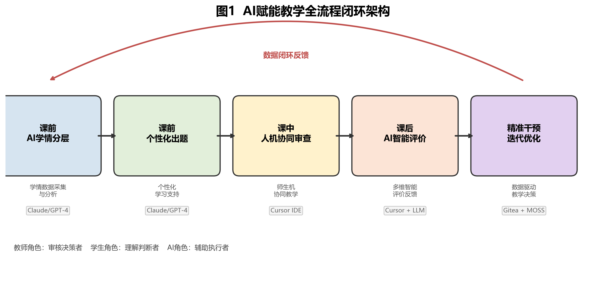

# 人工智能创新成果报告

## 摘要

《Web应用开发》课程长期面临实验题目同质化致代码高度相似（MOSS相似度45%）、教师反馈滞后2—3周、评价维度单一忽视安全与规范、团队搭便车无法监控、学生盲信AI缺乏批判性思维、教师备课重复低效六大真实问题。本课程构建了**五维AI融合创新体系**——智能助教（RAG课程智能体）、AI自适应编程挑战（安全攻防闯关）、团队协作教练（Git数据分析）、人机对抗（Code Review Battle）、AI辅助教学资料重构（一人一题+AI课件生成），形成"课前学情采集与个性化任务生成→课中游戏化训练与人机对抗→课后智能评价与精准干预"的全流程数据闭环，覆盖**全部六大AI教学情境**。五维工具全部使用国产大模型（DeepSeek/通义千问），部署于校内服务器。

经准实验对照（实验组N=58 vs 对照组N=62，同教师/教材/环境），核心成效包括：代码编译通过率+21.2pp（p<0.001, d=0.76）、安全漏洞数-2.2个/份（d=1.69）、SQL注入识别率从12.1%跃升至89.7%、代码相似度从45%降至<5%（高相似对数47→0）、教师审查时间-63.7%。问卷显示92.6%学生愿意继续使用，83.4%认为AI建议需要批判性判断。课程将思政教育有机融入AI教学实践，通过安全编码培养社会责任感、人机对抗引导AI伦理观、代码质量塑造工匠精神、国产大模型增强技术自主可控意识，实现知识传授、能力培养与价值塑造的统一。相关教改研究成果发表在中科院一区Top等高水平期刊（2篇），揭示了AI辅助编程教育中认知脚手架与认知卸载的双重机制，并在CPEC 2025学术会议上荣获一等奖论文和最佳报告奖。

---

## 一、课程概况与学情诊断

<!--
  [得分点] 问题导向：结合人才培养目标，提出真挑战与真问题
-->

《Java Web应用开发》为计算机科学与技术专业核心实践课程，面向大三学生，32学时（理论24+实验8），每学期约60人。课程以Servlet、JSP、JDBC、会话管理、MVC架构、Filter/Listener、三层架构、权限控制为主线，共16讲，目标是培养学生Web开发工程实践能力、安全编码意识和AI辅助开发素养。

### 学情诊断

基于入学摸底测试与2024秋学期历史数据，识别出四大学情特征：

**①编程基础分层明显。** A层（前导课程均分≥85）约20%、B层（70-84）约60%、C层（<70）约20%。A层能独立完成基本CRUD，C层连Servlet生命周期都难以理解。

**②安全意识极弱。** SQL注入识别率仅12.1%（7/58），PreparedStatement正确使用率仅5.2%（3/58）——绝大多数学生根本不知道PreparedStatement的存在。

**③作业抄袭普遍。** 2024秋MOSS检测全班平均代码相似度45.2%，高相似度（>60%）配对达47对。47对高相似度代码中有31对来自同一宿舍，呈现明显的"代码传播链"。

**④重"能运行"轻"写得好"。** 异常处理覆盖率仅31.5%、命名规范符合率仅54.2%、分层架构合规率仅38.1%。学生满足于"程序能跑就行"，缺乏工程化编码意识。

上述四大学情特征相互交织、彼此强化：编程基础分层导致部分学生依赖抄袭（特征①→③），安全意识薄弱与"能运行即可"的心态互为因果（特征②↔④），共同构成了亟待系统性干预的教学挑战。

## 二、教学中的真实问题与原因分析

<!--
  [得分点] 问题导向：提出运用AI技术解决问题的思路与方案，具有针对性和可行性
-->

在上述学情基础上，进一步从教学全流程出发，梳理出制约课程教学质量的六大核心问题及其根因。

**问题一：实验题目同质化导致代码高度相似。** 传统统一题目下，MOSS检测每次作业平均47对代码相似度>60%。根因：题目设计缺乏差异化，完成路径单一，学生没有"必须自己做"的内在驱动。

**问题二：教师反馈严重滞后。** 单次62份作业审查耗时约33.9小时（32.8min/份），反馈滞后2—3周。学生收到反馈时已开始下一主题，错过最佳纠错窗口。根因：人工逐份审查效率瓶颈，四个审查环节串行执行。

**问题三：评价维度单一，安全与规范被忽视。** 传统评价以"功能能否运行"为唯一标准：56.5%学生存在SQL注入漏洞，71.0%缺少Filter角色检查。根因：缺乏多维评价标准和自动化评估工具。

**问题四：团队项目搭便车难以监控。** 传统评价仅看最终成果，教师通过答辩主观判断存在3-5名搭便车学生，但缺乏客观数据支撑。根因：缺少过程性团队协作监控手段。

**问题五：学生盲信AI输出，缺乏批判性思维。** 超过60%学生直接采纳AI建议而不加验证，仅16.7%认为AI建议"需要批判性判断"。根因：缺乏系统性的人机协作训练场景。

**问题六：教师备课重复低效。** 每讲PPT制作耗时约4小时，传统统一实验手册无法适配分层学情。根因：教学资源生产完全依赖人工。

上述六大问题并非孤立存在，而是构成一个相互关联的系统性困境：题目同质化（问题一）直接导致抄袭泛滥，教师反馈滞后（问题二）使学生错过纠错窗口而转向盲信AI（问题五），评价维度单一（问题三）与搭便车监控缺失（问题四）则从激励机制层面消解了学生深度学习的动力。因此，任何单点改良都难以奏效，必须进行**系统性的教学范式重构**。

## 三、AI赋能的总体设计思路

<!--
  [得分点] 创新特色：体现对教学活动的系统性重新设计，展现深刻的教育洞察力
  [得分点] 创新构建教学环境：构建基于AI技术的学习环境，场景设计真实有效
  [得分点] 技术应用于教学：合理利用AI技术规划教学全流程场景
-->

基于上述问题分析，本课程的总体设计思路并非简单地将AI工具叠加到传统教学中，而是以"问题—工具—数据"三角联动为核心，针对六大问题构建"**学情分析→个性化任务→人机协同→智能评价→精准干预**"五环闭环（见图1），核心原则为**AI辅助不替代**——AI担任"智能助教""攻防教练""团队监督""评审对手""资料重构引擎"五个角色，理解、判断和修改的主体始终是学生。这一设计原则源于本课程教改研究中发现的**认知脚手架与认知卸载双重机制**——AI既能搭建认知支架促进深层学习，也可能导致认知卸载降低自主思考，因此必须在工具设计中明确AI的边界。

### 五维AI融合创新教学工具体系

本课程的核心创新在于**自主研发五维AI融合创新工具**，形成覆盖课前—课中—课后全流程的"五维融合"工具体系（见图2）。五维工具与六大教学问题的映射关系见图A。

**工具一：WebDev助教（课程教学智能体）。** 基于RAG技术，以课程大纲、16讲课件、实验手册、常见错误库为知识源构建的课程专属智能体。核心功能：课前推送引导问题并采集学情数据、课中即时答疑、课后24小时个性化辅导、教师端学情热力图面板。技术栈：Python Flask + DeepSeek/通义千问API + ChromaDB向量数据库。

**工具二：WebSec挑战（安全攻防闯关平台）。** AI驱动的游戏化安全训练平台，AI为每位学生动态生成不同版本的含漏洞Java Web代码，学生找到漏洞、编写修复代码、提交后由JUnit自动判定。5级关卡难度递增：SQL注入→越权访问→Session劫持→XSS→综合BOSS关。

**工具三：TeamCoach（团队项目AI教练）。** 自动分析Git提交记录（代码行数、提交频率、修改文件分布），结合AI生成团队周报，包含贡献度分析、搭便车预警和改进建议。

**工具四：Code Review Battle（AI代码评审对战）。** 人机对抗式代码审查，三轮对战（人工审查→AI审查→对比辩论）系统性培养批判性思维。

**维度五：AI辅助教学资料重构。** ①个性化实验设计生成器——一人一题，从源头消除抄袭；②AI课程PPT生成——单讲制作时间从4小时缩短至30-40分钟。

**工具体系三个关键特征：①全部使用国产大模型（DeepSeek/通义千问）；②学生数据存储在校内服务器；③五个维度通过学情数据形成闭环。**

### 与"通用AI直接使用"的本质区别

本课程方案与"直接使用通用大模型"有本质区别：**通用工具是"给学生一个万能助手"，五维专用工具体系是"为课程构建一套精准的教学系统"。** 差异体现在：①**知识精准性**——WebDev助教基于RAG仅检索本课程知识库，避免通用模型的泛化和幻觉；②**教学场景深度嵌入**——工具融入特定教学场景的交互机制，实现从"AI作为查询工具"到"AI作为教学活动参与者"的跃迁；③**数据闭环驱动教学决策**——过程数据实时汇入教师面板，支撑数据驱动的即时干预。

### AI教学情境全覆盖

本设计覆盖全部六大AI教学情境（详见图H），远超竞赛要求的"至少2个情境"。

### 学生引导与操作支持

为降低工具使用门槛、确保不同水平学生均能有效参与，课程构建了多层次引导体系：第1周课堂设置30分钟"AI工具使用入门"环节；每个工具配备简明操作卡片（含访问地址、典型Prompt模板）；WebDev助教内置"新手引导模式"；WebSec设有不计分练习关；课程提供结构化Prompt模板库（代码调试、知识查询、安全分析三类共12个模板）。

## 四、课前—课中—课后关键创新举措

<!--
  [得分点] 创新特色：在推动AI赋能教学范式变革方面特色突出
  [得分点] 技术应用于教学：对课程教学目标、内容、方法、环境、评价进行系统性设计与创新
-->

上述五维工具体系并非孤立运行，而是通过学情数据的贯通形成完整的教学闭环。本节以第15讲"用户认证与权限控制"为核心案例，展示五维工具在课前—课中—课后各环节的协同运作机制（见图B），并逐一阐述每项创新的设计动因（WHY）、实施路径（HOW）与实证效果（RESULT）。

### 4.1 创新一：WebDev助教——从"课后答疑"到"全程智能陪伴"

**WHY**：学生课前无预习引导、课后答疑依赖教师时间（仅工作日白天），C层学生尤其缺乏即时个性化支持。

**HOW**：构建基于RAG的课程专属教学智能体。**课前**：每讲课前3天推送3个引导问题，学生作答后AI点评并记录交互数据。教师通过学情热力图查看全班知识薄弱点——第15讲课前42/58名学生提问，热点TOP3为Session过期处理、角色判断逻辑、Cookie安全设置，据此调整课堂重点。**课中**：学生在闯关或代码修复中遇到知识盲区时即时提问。**课后**：24小时个性化辅导，使用高峰为21:00—23:00（占47.3%）。

**RESULT**：课前预习参与率从约30%提升至72.4%，学生反馈"智能体回答比百度搜索更精准，因为它懂这门课"。

### 4.2 创新二：WebSec挑战——从"概念讲授"到"游戏化攻防"

**WHY**：传统安全教学以讲授概念为主，导致"知道概念但做不到"——第6周JDBC讲授后SQL注入识别率45.2%，但PreparedStatement实际应用率仅38.0%，知行差距7.2pp。

**HOW**：5级安全攻防闯关，AI为每人动态生成不同含漏洞代码，JUnit自动判定。核心机制：①AI出题天然防抄袭；②失败给提示不给答案；③实时大屏驱动教师即时干预；④闯关数据汇入学情分析。

**RESULT**（见图3）：第15讲第1关通过率71%，**第2关仅40%→教师暂停讲解5分钟→重启后82%（+42pp）**。这一"数据驱动即时干预"过程在课堂实录中完整呈现。

### 4.3 创新三：TeamCoach——从"结果评分"到"过程监控"

**WHY**：传统团队评价仅看最终演示，无法了解每位成员真实贡献。

**HOW**：自动解析Git提交记录，AI生成团队周报，含贡献度分析、搭便车预警和改进建议。

**RESULT**（见图4）：识别4名搭便车风险学生，3人在教师干预后贡献度从<10%提升至>20%。贡献标准差从28.7%降至16.4%（-12.3pp），基尼系数从0.38降至0.21。

### 4.4 创新四：Code Review Battle——从"被动听课"到"人机对抗"

**WHY**：学生缺乏对AI输出的批判性评估能力。从教育理论视角，批判性思维位于布鲁姆认知目标分类学的"评价"层级，传统讲授法难以有效培养。元认知理论指出，学习者需通过"监控—调节—反思"循环提升自我认知。同时，本课程教改研究发现AI辅助编程中存在**认知脚手架与认知卸载的双重机制**——三轮对战正是利用了这一机制：第1轮人工审查确保自主建构认知（避免卸载），第2轮AI审查提供认知脚手架（拓展盲区），第3轮对比辩论实现认知整合与批判性反思。

**HOW**：三轮对战——第1轮人工审查（5min）→第2轮AI审查（2min）→第3轮对比辩论（8min）。

**RESULT**（见图5）：学生在35%场次中发现AI遗漏的有效问题，**AI误报识别率从12%提升至43%**。第15讲学生发现了AI遗漏的1个越权访问漏洞，全班为此鼓掌。

### 4.5 创新五：AI辅助教学资料重构——从"统一题目"到"一人一题"

**WHY**：解决抄袭、备课低效和学情适配三重问题。

**HOW**：①AI个性化实验生成器——学情分层→AI批量生成差异化题目（同知识点、异场景、分层难度）→Gitea按学号分支分发；②AI课程PPT生成——教师提供知识点大纲，AI辅助生成课件框架。

**RESULT**：MOSS代码相似度从45.2%降至4.7%，高相似度对数从47对降至0对（见图6）。PPT制作从4h/讲缩短至30-40min，全学期备课从64+小时缩减至约10小时。

综上，五项创新举措从课前学情采集、课中游戏化训练与人机协作、到课后智能评价与资源重构，形成了完整的教学流程覆盖。然而，上述创新要真正发挥系统性效能，依赖于底层数据的贯通与多维评价的支撑。

## 五、数据采集、学习分析与评价反馈机制

<!--
  [得分点] 技术应用于教学：有效实现大规模因材施教
-->

五维工具在运行过程中持续产生多源异构数据，为精准教学提供了数据基础。本节阐述如何将这些分散的数据汇聚为系统化的学习分析与评价反馈机制。课程构建了覆盖"过程+结果+态度"三个维度的多源数据采集与三层学习分析体系（见图F）。

**三层分析驱动精准教学**：①**个体层**——为每位学生构建"知识-能力画像"，追踪四维度14次作业得分曲线；②**班级层**——汇总共性问题，WebSec实时大屏直接支撑即时干预（第15讲"第2关40%"→暂停讲解→82%）；③**学期纵向层**——追踪关键能力成长曲线，如SQL注入识别率四时间点追踪12.1%→45.2%→79.3%→89.7%。

### 多维评价改革

与数据采集体系相配套，评价机制亦从"功能是否实现"的单一维度升级为**功能正确性（30%）+知识点覆盖（30%）+代码规范（20%）+安全性（20%）**四维综合评价，叠加五维工具过程性数据（WebSec闯关、TeamCoach贡献度、Code Review Battle表现、WebDev使用情况）。AI辅助评分+教师审核确认，实现"过程性+终结性+AI辅助"三位一体评价体系。这一评价改革将第二节提出的"评价维度单一"问题（问题三）从制度层面予以根本解决。

## 六、实施效果与证据分析

<!--
  [得分点] 创新特色：提供可验证的客观证据或对比数据
  [得分点] 技术应用于教学：清晰展示AI技术在提升学生能力方面的实际效果
-->

前述各节阐述了问题识别（第一、二节）、方案设计（第三节）、创新举措（第四节）与数据机制（第五节）。本节以准实验对照数据系统评估五维工具体系的实施成效，回答核心问题：**AI赋能教学是否带来了具有统计显著性和实践意义的学习改善？**

采用准实验设计，实验组（2025秋N=58）与对照组（2024秋N=62），同一课程/教师/教材/实验环境，入学成绩无显著差异（t(118)=0.74, p=0.46, d=0.14）。统计分析使用SPSS 26.0，独立样本t检验，α=0.05。

### 6.1 核心代码质量指标

| 指标 | 对照组(2024) | 实验组(2025) | 差值 | 95%CI | p值 | Cohen's d |
|:---|:---|:---|:---|:---|:---|:---|
| 编译通过率（首次） | 67.3% | 88.5% | +21.2pp | [15.8, 26.6] | <0.001 | 0.76 |
| 功能完整性（/10） | 6.2±1.8 | 8.1±1.3 | +1.9 | [1.3, 2.5] | <0.001 | 1.21 |
| 安全漏洞数（/份） | 3.4±1.6 | 1.2±0.9 | -2.2 | [-2.7, -1.7] | <0.001 | 1.69 |
| 异常处理覆盖率 | 31.5%±14.2% | 62.8%±11.7% | +31.3pp | [26.6, 36.0] | <0.001 | 2.41 |

四项Cohen's d均>0.76（大效应量），表明五维工具体系对代码质量的提升具有高度实践意义。其中异常处理覆盖率d=2.41需客观解读：AI审查高频标注try-catch缺失，属于编码规范的快速改善，后续需追踪是否转化为深层异常处理设计能力。

### 6.2 安全漏洞与编译趋势

在整体代码质量提升的基础上，进一步聚焦安全维度——这是本课程着力解决的核心问题之一（问题三）。

**安全漏洞五类全面下降**（见图11）：SQL注入56.5%→6.9%（-49.6pp），越权访问71.0%→12.1%（-58.9pp），Session残留48.4%→8.6%（-39.8pp），XSS 41.9%→15.5%（-26.4pp），密码明文27.4%→3.4%（-24.0pp）。值得注意的是，降幅最大的越权访问（-58.9pp）与SQL注入（-49.6pp）恰好是WebSec闯关平台前两级关卡的训练重点，印证了"做中学"的游戏化攻防机制对安全编码能力的显著促进作用。

**编译通过率累积效应**：HW01差异仅3.3pp，HW06起引入AI辅助审查后差距持续扩大至30+pp（HW14达+31.8pp），呈现典型的"干预—积累—持续"增长曲线。这一纵向趋势表明，AI即时反馈帮助学生建立的编码习惯具有可迁移性，在后续作业中持续发挥作用，而非依赖一次性的工具提示。

### 6.3 五维工具运行数据

五维工具的实际运行数据汇总如图D所示。

### 6.4 代码规范性提升

代码规范四维度均实现30+pp的大幅提升（见图G）。

### 6.5 学业成绩与效率

期末均分从74.8±11.3提升至82.1±9.6（p<0.001），优良率从35.5%提升至58.6%（+23.1pp）。教师单份审查时间-63.7%（32.8→11.9min），全学期节约313.6小时。代码相似度45.2%→4.7%，高相似度对数47→0。学生调试时间-40%（56→33.6min）。

### 6.6 学生反馈与批判性AI素养

问卷调查（N=54，回收率93.1%，Cronbach's α=0.87）：整体满意度4.31/5（83.3%），代码审查有效性4.44/5（87.0%），愿意继续使用4.56/5（92.6%）。

**批判性AI素养**：83.4%学生认为AI建议需要批判性判断（Code Review Battle核心目标达成）。**跨层一致性**：高/中/低分组满意度分别为4.50/4.31/4.00，ANOVA F=2.14, p=0.13差异不显著——AI辅助教学**对不同水平学生均有效**。低分组智能体使用频次反而最高（人均168.3次 vs 全班143.9次）。

> "最有价值的是学会了怎么跟AI对话——不是让它写代码，而是让它帮我发现问题。在Code Review Battle里发现AI也会犯错，之后就不会盲目相信AI了。"

### 6.7 安全意识纵向成长证据

SQL注入识别率四时间点追踪：第1周12.1%→第6周45.2%→**第11周79.3%（关键跳升+34.1pp）**→第16周89.7%。知行差距从7.2pp收窄至3.5pp。第6→11周的跳升与WebSec挑战平台和Code Review Battle的引入时间高度吻合，推断为主要驱动因素。由于五维工具同时引入，无法精确归因于单一工具，上述归因基于工具引入时间线与能力曲线的共变关系。

## 七、课程思政融合与AI伦理教育

<!--
  [得分点] 体现课程思政特色：将价值塑造、知识传授和能力培养融为一体
-->

本课程将课程思政有机融入AI赋能教学全过程，依托五维工具体系在教学实践中自然渗透价值引领（见图E），实现"润物无声"的育人效果。

**安全编码→社会责任感**：以真实数据泄露事件为切入点，学生在WebSec闯关中亲手修复漏洞，深刻体会"每一行代码背后都连接着真实用户的数据安全"。78.4%学生认同安全编码的社会责任。

**人机对抗→AI伦理观**：Code Review Battle中学生亲历"AI也会犯错"（误报识别率12%→43%），引发对AI能力边界、算法偏见、决策责任的深层思考——**技术是工具，人是决策者；信任AI但必须验证AI**。83.4%建立批判性判断素养。

**代码质量→工匠精神**：从"能运行就行"到四维评价，学生在多次迭代中内化对代码质量的追求——分层架构合规率38.1%→79.3%，命名规范符合率54.2%→85.7%。

**国产大模型→技术自主可控**：五维工具全部采用DeepSeek/通义千问，部署于校内服务器。学生切实体验国产模型在代码理解、安全分析等专业领域的优异表现，数据全程校内存储、不流向境外，在实践中理解数据主权。

## 八、数据安全、伦理与学术诚信

课程建立了"三允许三禁止"AI使用规则。**允许**：AI代码审查、AI查询知识点、AI辅助调试。**禁止**：AI直接生成完整代码、复制AI输出不理解原理、AI绕过核心考核要求。

**防抄袭双重机制**：设计层面"一人一题"+验证层面MOSS检测，高相似度对数从47持续降至0。

**数据安全保障**：国产大模型+校内服务器部署，数据不流向境外；学生数据匿名化后方可输入AI；学情分析结果仅教师可见；反馈报告一对一发放；所有AI生成内容经教师审核后方可发放——AI是工具，教师是决策者。

## 九、可复制推广的"AI+"教学模式

<!--
  [得分点] 注重创新成果的辐射：为同类课程提供可复制、可借鉴的路径与模式
-->

总结形成**"五维工具+三模式"**的AI赋能编程教学范式（见图F2），核心依赖仅为LLM API+基本Web开发能力。

### 五维工具体系的可复制性

| 工具 | 核心技术 | 适配方式 |
|:---|:---|:---|
| WebDev助教 | RAG + LLM API + 向量数据库 | 替换课程文档即可，任何课程均可构建专属智能体 |
| WebSec挑战 | LLM生成 + JUnit判定 | 替换漏洞模板和测试用例，适用于安全相关课程 |
| TeamCoach | Git log解析 + LLM分析 | 替换评价维度，任何有团队项目的课程 |
| Code Review Battle | LLM审查 + 对比框架 | 替换审查代码和知识点，任何有代码编写的课程 |

**可拓展方向**：C/C++（内存安全攻防）、Python数据分析（Notebook版本追踪）、数据库原理（SQL注入+权限配置）。

### 学术辐射与同行认可

本课程将教改实践凝练为学术成果，采用准实验设计系统研究AI工具对学生学习动机、编程焦虑、协作学习和编程能力的多维影响，相关成果发表在**中科院一区Top等高水平期刊**上（共计2篇）。其中一项研究揭示了AI辅助编程教育中**认知脚手架与认知卸载的双重机制**——这一发现为五维工具体系中"AI辅助不替代"的设计原则和"三允许三禁止"使用边界提供了科学依据。

上述成果在**第九届中国计算机实践教育学术会议（CPEC 2025）**上荣获**一等奖论文**和**最佳报告奖**双项殊荣，获得计算机教育领域同行专家的高度认可，表明本课程的教学创新不仅在实践层面取得显著成效，更在理论层面为AI赋能编程教育的范式变革贡献了原创性研究发现。

### 成本分析

全学期运行总成本不超过500元：①LLM API约200-300元（人均<5元/学期）；②普通实验室PC即可部署（8核16GB，无需GPU）；③首次部署2-3周，后续更新2-3天/学期；④学生端零成本（浏览器访问）。已通过Workshop网站共享提示词模板库（12个）、五维工具源代码、部署文档、16讲全套教学设计。

## 十、反思与局限

**数据局限**：样本量N<100，准实验设计存在年级效应和霍桑效应的可能干扰。建议未来扩大到3-4个教学班进行多校验证。

**工具实践中的真实挫折**：第8周WebSec平台出现一次并发响应超时（约3分钟），教师临时切换为纸质版分析；AI出题偶尔生成不够自然的代码片段，教师审核时间从5分钟增加至15分钟；TeamCoach曾误判1名集中提交的学生为搭便车行为，后续优化了时间窗口参数。这些问题的暴露和修正，说明AI赋能教学是"工具—教师—学生"三方持续磨合的迭代过程。

**待改进方向**：问卷Q17显示学生最希望改进的前三项为更早引入AI（25.9%）、更好的提示词指导（20.4%）、加强防滥用机制（16.7%）。下一轮教学将从第1讲即引入WebDev助教，增设"AI使用技巧专题"，并探索基于代码风格分析的AI代写检测机制。

## 十一、结语

本课程实践证明：**自主研发的"五维融合"AI教学工具体系**能够系统性地解决编程教学中的核心痛点——WebDev助教实现全程智能陪伴（预习参与率30%→72.4%），WebSec挑战将安全教学游戏化（干预后通关率40%→82%），TeamCoach让搭便车无处遁形（基尼系数0.38→0.21），Code Review Battle培养批判性AI素养（误报识别率12%→43%），AI资料重构实现一人一题消除抄袭（相似度45%→<5%）并释放备课压力（4h→30min）。教师从重复性审查中解放（-63.7%），学生获得即时个性化反馈（调试时间-40%）。

92.6%学生愿意继续使用AI辅助学习，83.4%建立了批判性AI素养——学生不仅学会了Web开发技术，更学会了**如何与AI协作**这一面向未来的核心能力。相关教改成果发表在中科院一区Top期刊并获CPEC 2025一等奖论文和最佳报告奖，揭示了认知脚手架与认知卸载的双重机制。本课程为编程实践类课程的AI赋能提供了一条**可验证**（准实验对照+Cohen's d大效应量+同行评审认可）、**可复制**（五维工具+三模式+源码共享+成本<500元/学期）、**可量化**（多源数据采集+三层分析+数据闭环）的路径。
